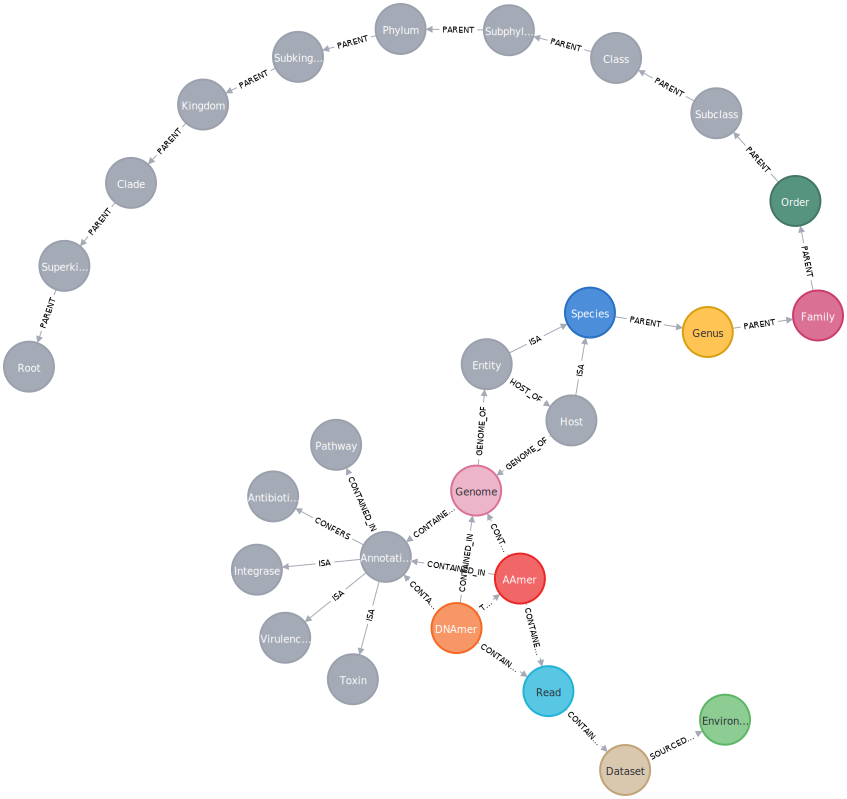
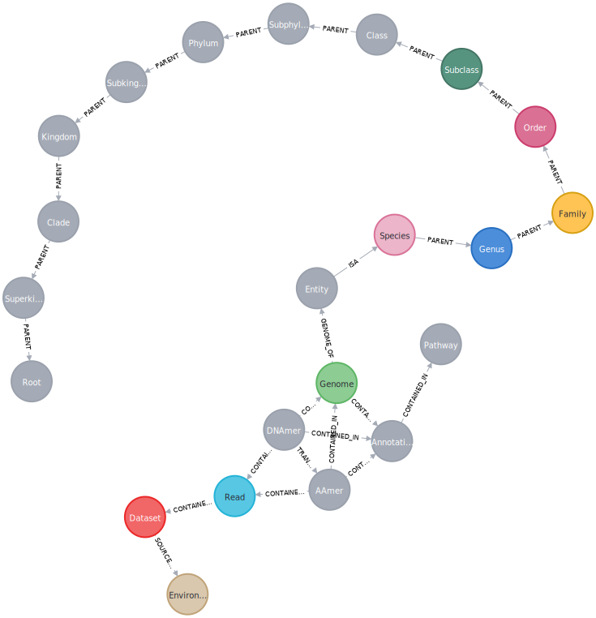

# Mycelia

biological knowledge graphs for "omics" powered by [JuliaGraphs](https://github.com/JuliaGraphs), [BioJulia](https://github.com/BioJulia), and [Neo4J](https://neo4j.com/)

<!-- [](https://cameronprybol.gitlab.io/Mycelia.jl/dev) -->
<!-- [](https://github.com/cjprybol/Mycelia.jl/pipelines) -->
<!-- [](https://github.com/cjprybol/Mycelia.jl/commits/master) -->
<!-- [](https://ci.appveyor.com/project/cjprybol/Mycelia-jl) -->
<!-- [](https://cloud.drone.io/cjprybol/Mycelia.jl) -->
<!-- [](https://codecov.io/gh/cjprybol/Mycelia.jl) -->
<!-- [](https://github.com/SciML/ColPrac) -->

## Install
```julia
(@v1.5) pkg> add git@github.com:cjprybol/Mycelia.git
```

## Related Software:
- [PanTools](https://www.bioinformatics.nl/pangenomics/manual/) ([paper](https://pubmed.ncbi.nlm.nih.gov/27587666/))
- [BioJulia/GenomeGraphs.jl](https://github.com/BioJulia/GenomeGraphs.jl)
- [Pangenome Graphs Review](https://doi.org/10.1146/annurev-genom-120219-080406)

## Questions:
- what is the kmer decomposition spectra of raw reads @ 90, 95, 99, 99.9, 99.99% accuracy
    - isolates?
    - communities?
- what are the sequence likelihoods when evaluating original reads vs their corrected versions
    - before -> after plots of alignment likelihood

## Behaviors

- Input(s):
    - fasta(s)
    - fastq(s)
- Output(s):
    - maximum likelihood assembly graph
        - kmer frequencies

- default assembly sizes = 
 13
 17
 23
 29
 37
 41
 47
 53
 59

- Input(s):
    - matrix of species frequency across samples
- Output(s):
    - correlation matrix and strength of relationship

- Input(s):
    - Genome query
- Output(s):
    - closest entity
    - distance from that entity
    - context about what are the distances between organisms at different levels of the NCBI tree
    - lowest NCBI taxonomy classification at k 1-63
    - annotations contained within

- Input(s):
- Output(s):

## Schema for a pan-meta-genome graph with annotations (multi-dataset)



```
//pan-meta-genome-graph-with-annotations
CREATE (dnamer:DNAmer {label: "DNAmer"})
CREATE (read:Read {label: "Read"})
CREATE (aamer:AAmer {label: "AAmer"})
CREATE (dataset:Dataset {label: "Dataset"})
CREATE (environment:Environment {label: "Environment"})
CREATE (genome:Genome {label: "Genome"})
CREATE (species:Species {label: "Species"})
CREATE (genus:Genus {label: "Genus"})
CREATE (family:Family {label: "Family"})
CREATE (order:Order {label: "Order"})
CREATE (subclass:Subclass {label: "Subclass"})
CREATE (class:Class {label: "Class"})
CREATE (subphylum:Subphylum {label: "Subphylum"})
CREATE (phylum:Phylum {label: "Phylum"})
CREATE (subkingdom:Subkingdom {label: "Subkingdom"})
CREATE (kingdom:Kingdom {label: "Kingdom"})
CREATE (clade:Clade {label: "Clade"})
CREATE (superkingdom:Superkingdom {label: "Superkingdom"})
CREATE (root:Root {label: "Root"})
CREATE (annotation:Annotation {label: "Annotation"})
CREATE (entity:Entity {label: "Entity"})
CREATE (pathway:Pathway {label: "Pathway"})
CREATE (toxin:Toxin {label:"Toxin"})
CREATE (virulencefactor:VirulenceFactor {label: "VirulenceFactor"})
CREATE (antibioticresistance:AntibioticResistance {label: "AntibioticResistance"})
CREATE (integrase:Integrase {label: "Integrase"})
CREATE (host:Entity {label: "Host"})

CREATE (entity)-[entity_host:HOST_OF]->(host)
CREATE (annotation)-[annotation_integrase:ISA]->(integrase)
CREATE (annotation)-[annotation_antibioticresistance:CONFERS]->(antibioticresistance)
CREATE (annotation)-[annotation_virulencefator:ISA]->(virulencefactor)
CREATE (annotation)-[annotation_toxin:ISA]->(toxin)
CREATE (host)-[host_species:ISA]->(species)
CREATE (host)-[host_genome:GENOME_OF]->(genome)
CREATE (dnamer)-[dnamer_annotation:CONTAINED_IN]->(annotation)
CREATE (aamer)-[aamer_annotation:CONTAINED_IN]->(annotation)
CREATE (genome)-[genome_annotation:CONTAINED_IN]->(annotation)
CREATE (superkingdom)-[superkingdom_root:PARENT]->(root)
CREATE (clade)-[clade_superkingdom:PARENT]->(superkingdom)
CREATE (kingdom)-[kingdom_clade:PARENT]->(clade)
CREATE (subkingdom)-[subkingdom_kingdom:PARENT]->(kingdom)
CREATE (phylum)-[phylum_subkingdom:PARENT]->(subkingdom)
CREATE (subphylum)-[subphylum_phylum:PARENT]->(phylum)
CREATE (class)-[class_subphylum:PARENT]->(subphylum)
CREATE (subclass)-[subclass_class:PARENT]->(class)
CREATE (order)-[order_subclass:PARENT]->(subclass)
CREATE (family)-[family_order:PARENT]->(order)
CREATE (genus)-[genus_family:PARENT]->(family)
CREATE (species)-[species_genus:PARENT]->(genus)
CREATE (entity)-[entity_species:ISA]->(species)
CREATE (dnamer)-[dnamer_genome:CONTAINED_IN]->(genome)
CREATE (dataset)-[dataset_environment:SOURCED_FROM]->(environment)
CREATE (read)-[read_dataset:CONTAINED_IN]->(dataset)
CREATE (aamer)-[aamer_read:CONTAINED_IN]->(read)
CREATE (dnamer)-[dnamer_read:CONTAINED_IN]->(read)
CREATE (dnamer)-[dnamer_aamer:TRANSLATES_TO]->(aamer)
CREATE (aamer)-[aamer_genome:CONTAINED_IN]->(genome)
CREATE (genome)-[genome_entity:GENOME_OF]->(entity)
CREATE (annotation)-[annotation_pathway:CONTAINED_IN]->(pathway)


RETURN dnamer,
read,
aamer,
dataset,
environment,
genome,
species,
genus,
family,
order,
subclass,
class,
subphylum,
phylum,
subkingdom,
kingdom,
clade,
superkingdom,
root,
annotation,
entity,
pathway,
annotation_pathway,
toxin,
virulencefactor,
antibioticresistance,
integrase,
host,
entity_host,
annotation_integrase,
annotation_antibioticresistance,
annotation_virulencefator,
annotation_toxin,
host_species,
host_genome

```

## Schema for a pan-meta-genome graph (multi-dataset)



```
//pan-meta-genome-graph
CREATE (dnamer:DNAmer {label: "DNAmer"})
CREATE (read:Read {label: "Read"})
CREATE (aamer:AAmer {label: "AAmer"})
CREATE (dataset:Dataset {label: "Dataset"})
CREATE (environment:Environment {label: "Environment"})
CREATE (genome:Genome {label: "Genome"})
CREATE (species:Species {label: "Species"})
CREATE (genus:Genus {label: "Genus"})
CREATE (family:Family {label: "Family"})
CREATE (order:Order {label: "Order"})
CREATE (subclass:Subclass {label: "Subclass"})
CREATE (class:Class {label: "Class"})
CREATE (subphylum:Subphylum {label: "Subphylum"})
CREATE (phylum:Phylum {label: "Phylum"})
CREATE (subkingdom:Subkingdom {label: "Subkingdom"})
CREATE (kingdom:Kingdom {label: "Kingdom"})
CREATE (clade:Clade {label: "Clade"})
CREATE (superkingdom:Superkingdom {label: "Superkingdom"})
CREATE (root:Root {label: "Root"})
CREATE (annotation:Annotation {label: "Annotation"})
CREATE (entity:Entity {label: "Entity"})
CREATE (pathway:Pathway {label: "Pathway"})

CREATE (dnamer)-[dnamer_annotation:CONTAINED_IN]->(annotation)
CREATE (aamer)-[aamer_annotation:CONTAINED_IN]->(annotation)
CREATE (genome)-[genome_annotation:CONTAINED_IN]->(annotation)
CREATE (superkingdom)-[superkingdom_root:PARENT]->(root)
CREATE (clade)-[clade_superkingdom:PARENT]->(superkingdom)
CREATE (kingdom)-[kingdom_clade:PARENT]->(clade)
CREATE (subkingdom)-[subkingdom_kingdom:PARENT]->(kingdom)
CREATE (phylum)-[phylum_subkingdom:PARENT]->(subkingdom)
CREATE (subphylum)-[subphylum_phylum:PARENT]->(phylum)
CREATE (class)-[class_subphylum:PARENT]->(subphylum)
CREATE (subclass)-[subclass_class:PARENT]->(class)
CREATE (order)-[order_subclass:PARENT]->(subclass)
CREATE (family)-[family_order:PARENT]->(order)
CREATE (genus)-[genus_family:PARENT]->(family)
CREATE (species)-[species_genus:PARENT]->(genus)
CREATE (entity)-[entity_species:ISA]->(species)
CREATE (dnamer)-[dnamer_genome:CONTAINED_IN]->(genome)
CREATE (dataset)-[dataset_environment:SOURCED_FROM]->(environment)
CREATE (read)-[read_dataset:CONTAINED_IN]->(dataset)
CREATE (aamer)-[aamer_read:CONTAINED_IN]->(read)
CREATE (dnamer)-[dnamer_read:CONTAINED_IN]->(read)
CREATE (dnamer)-[dnamer_aamer:TRANSLATES_TO]->(aamer)
CREATE (aamer)-[aamer_genome:CONTAINED_IN]->(genome)
CREATE (genome)-[genome_entity:GENOME_OF]->(entity)
CREATE (annotation)-[annotation_pathway:CONTAINED_IN]->(pathway)


RETURN dnamer,
read,
aamer,
dataset,
environment,
genome,
species,
genus,
family,
order,
subclass,
class,
subphylum,
phylum,
subkingdom,
kingdom,
clade,
superkingdom,
root,
annotation,
entity,
pathway,
annotation_pathway
```

## Schema for a metagenome graph (single dataset)


```
//meta-genome-graph
CREATE (dnamer:DNAmer {label: "DNAmer"})
CREATE (aamer:AAmer {label: "AAmer"})
CREATE (read:Read {label: "Read"})
CREATE (genome:Genome {label: "Genome"})
CREATE (annotation:Annotation {label: "Annotation"})
CREATE (pathway:Pathway {label: "Pathway"})

CREATE (dnamer)-[dnamer_annotation:CONTAINED_IN]->(annotation)
CREATE (aamer)-[aamer_annotation:CONTAINED_IN]->(annotation)
CREATE (genome)-[genome_annotation:CONTAINED_IN]->(annotation)
CREATE (annotation)-[annotation_pathway:CONTAINED_IN]->(pathway)
CREATE (dnamer)-[dnamer_genome:CONTAINED_IN]->(genome)
CREATE (aamer)-[aamer_read:CONTAINED_IN]->(read)
CREATE (dnamer)-[dnamer_read:CONTAINED_IN]->(read)
CREATE (dnamer)-[dnamer_aamer:TRANSLATES_TO]->(aamer)
CREATE (aamer)-[aamer_genome:CONTAINED_IN]->(genome)

RETURN dnamer,
read,
aamer,
genome,
annotation,
pathway,
annotation_pathway
```

## Example Queries

English
```
CYPHER
```

- Give me the genome of entity x
- Give me the pangenome of species x
- Give me the pangenome of order x
- Give me all kmers in species x

- Finding spacers:
- Give me all kmers in species x matching pattern y
- Give me all datasets containing species x
- Give me all datasets containing pathway x
- Give me all reads supporting path/variant x

## Creating a blank database

https://neo4j.com/developer/neo4j-desktop/#desktop-create-project

## Interacting with a Database

- username: neo4j
- password: password
    - I set this and yours may be different!
   

https://neo4j.com/developer/manage-multiple-databases/

https://stackoverflow.com/a/29658062
https://neo4j.com/docs/operations-manual/current/tools/cypher-shell/#cypher-shell-syntax
https://contentaudience.com/guides/neo4j-cli-cypher-shell/
https://neo4j.com/developer/kb/how-do-i-authenticate-with-cypher-shell-without-specifying-the-username-and-password-on-the-command-line/

[Bulk import](https://neo4j.com/developer/guide-import-csv/)

## Database

- Basic Alphabets
    - Canonical Nucleic Acids
    - Canonical Amino Acids
- Types of paths
    - DNAmers
        - DNAmers are canonical dna sequences of k-length
        - we track all odd primes between 1 and 31 for DNA mers
        - we track DNAmers 3, 9, 15, and 21 for interoperability between AAmers and the DNAmers they translate from
        - kmers store both their full sequences AND their sequences as paths through shorter kmers
    - AAmers
        - we track all odd primes between 1 and 5 for AA mers
        - kmers store both their full sequences AND their sequences as paths through shorter kmers
    - Genomes
        - genomes are paths through DNA kmers
    - annotations
        - annotations are paths through DNA kmers and possibly also through AA kmers


## Creating probabilistic assemblies
1. Build weighted [de-bruijn graphs](https://en.wikipedia.org/wiki/De_Bruijn_graph) with observed data
2. Use the weighted de-bruijn graph as a [hidden markov model](https://en.wikipedia.org/wiki/Hidden_Markov_model) to [error correct observations](https://en.wikipedia.org/wiki/Viterbi_algorithm)
3. Use the error-corrected observations to build a new, more accurate weighted de-bruijn graph
4. Repeat 1-3 until convergence
5. Return maximum likelihood assembly

Consider for graph cleaning:
  - [x] Solve most likely path (slow but robust) vs
  - [ ] resample most likely paths (fast, less theoretically sound)
    - fairly certain that this is what the Flye assembler does


## Implementation requirements

- kmer spectra -> signal detection
- kmer size with signal -> initial assembly graph
    - bandage visualization
- initial assembly graph + reads -> iterative assembly
    - bandage visualization
- final assembly
    - bandage visualization
- annotation
    - find all start codons
    - find all stop codons
    - report in fasta format all coding regions
    - try and verify against prodigal to make sure that we aren’t missing any

- graph -> path -> sequence -> amino acid sequence

## API

- Need to allow users to add individual datasets to database
- does a sequence exist?
  - does a sequence exist allowing n mismatches
  - relative likelihood and frequency of most similar paths
    - this is just the viterbi traversal
- reads supporting traversal, and the datasets they came from
- connected components (species) containing path
- phylogenetic hierarchy of a component
  - nodes <-> kmers
- which datasets are a given kmer present in?
- export and import with GFA
- condense kmer graphs to simplified graphs
- visualization 
  - with Bandage (works automatically with GFA)
  - with Neo4J visualization library
  
  
## Learning to use Cyper CLI
```
usage: cypher-shell [-h] [-a ADDRESS] [-u USERNAME] [-p PASSWORD] [--encryption {true,false,default}] [-d DATABASE]
                    [--format {auto,verbose,plain}] [-P PARAM] [--debug] [--non-interactive] [--sample-rows SAMPLE-ROWS]
                    [--wrap {true,false}] [-v] [--driver-version] [-f FILE] [--fail-fast | --fail-at-end] [cypher]

A command line shell where you can execute Cypher against an  instance  of  Neo4j.  By default the shell is interactive but you can use it
for scripting by passing cypher directly on the command line or by piping a file with cypher statements (requires Powershell on Windows).

example of piping a file:
  cat some-cypher.txt | cypher-shell

positional arguments:
  cypher                 an optional string of cypher to execute and then exit

optional arguments:
  -h, --help             show this help message and exit
  --fail-fast            exit and report failure on first error when reading from file (this is the default behavior)
  --fail-at-end          exit and report failures at end of input when reading from file
  --format {auto,verbose,plain}
                         desired output format, verbose displays results  in  tabular  format  and  prints statistics, plain displays data
                         with minimal formatting (default: auto)
  -P PARAM, --param PARAM
                         Add a parameter to this session. Example: `-P "number => 3"`. This argument can be specified multiple times.
  --debug                print additional debug information (default: false)
  --non-interactive      force non-interactive mode, only useful if auto-detection fails (like on Windows) (default: false)
  --sample-rows SAMPLE-ROWS
                         number of rows sampled to compute table widths (only for format=VERBOSE) (default: 1000)
  --wrap {true,false}    wrap table column values if column is too narrow (only for format=VERBOSE) (default: true)
  -v, --version          print version of cypher-shell and exit (default: false)
  --driver-version       print version of the Neo4j Driver used and exit (default: false)
  -f FILE, --file FILE   Pass a file with cypher statements to be executed.  After  the statements have been executed cypher-shell will be
                         shutdown

connection arguments:
  -a ADDRESS, --address ADDRESS
                         address and port to connect to (default: neo4j://localhost:7687)
  -u USERNAME, --username USERNAME
                         username to connect as. Can also be specified using environment variable NEO4J_USERNAME (default: )
  -p PASSWORD, --password PASSWORD
                         password to connect with. Can also be specified using environment variable NEO4J_PASSWORD (default: )
  --encryption {true,false,default}
                         whether the connection to Neo4j should  be  encrypted.  This  must  be  consistent with Neo4j's configuration. If
                         choosing 'default' the encryption setting is  deduced  from  the  specified  address. For example the 'neo4j+ssc'
                         protocol would use encryption. (default: default)
  -d DATABASE, --database DATABASE
                         database to connect to. Can also be specified using environment variable NEO4J_DATABASE (default: )
```

List databases
```
# verbose outputs mdtable with pretty printing
cypher-shell --address neo4j://localhost:7687 --username neo4j --password password --database system --format verbose 'show databases'
# plain outputs a CSV
cypher-shell --address neo4j://localhost:7687 --username neo4j --password password --database system --format plain 'show databases'
# auto uses verbose
cypher-shell --address neo4j://localhost:7687 --username neo4j --password password --database system --format auto 'show databases'
```

Creating a database for a specific dataset
```
cypher-shell --address neo4j://localhost:7687 --username neo4j --password password --database system --format auto 'create database test'
```

Show schema
```
cypher-shell --address neo4j://localhost:7687 --username neo4j --password password --database test --format auto 'CALL db.schema.visualization()'
```

Return all nodes
```
cypher-shell --address neo4j://localhost:7687 --username neo4j --password password --database test --format auto 'MATCH (n) RETURN n'
```

Delete entire graph
```
cypher-shell --address neo4j://localhost:7687 --username neo4j --password password --database test --format auto 'MATCH (n) DETACH DELETE n'
```

Add kmers and connections in one go
```
cypher-shell --address neo4j://localhost:7687 --username neo4j --password password --database test --format auto 'MERGE (d1:DNAmer {sequence: "A"})-[d1d2:CONNECTION {orientations: [1,1]}]->(d2:DNAmer {sequence: "T"}) RETURN *'
```

Add kmers and connections in separate steps
```
cypher-shell --address neo4j://localhost:7687 --username neo4j --password password --database test --format auto 'MERGE (:DNAmer {sequence: "A"})'
cypher-shell --address neo4j://localhost:7687 --username neo4j --password password --database test --format auto 'MERGE (:DNAmer {sequence: "T"})'
cypher-shell --address neo4j://localhost:7687 --username neo4j --password password --database test --format auto 'MERGE (d1:DNAmer {sequence: "A"})-[d1d2:CONNECTION {orientations: [1,1]}]->(d2:DNAmer {sequence: "T"}) RETURN *'
```


find all nmers
```
cypher-shell --address neo4j://localhost:7687 --username neo4j --password password --database test --format auto 'MATCH (d:DNAmer) WHERE size(d.sequence) = 1 return d'
```

create import uniqueness constraints
```
CREATE CONSTRAINT ON (d:Dnamer) ASSERT d.sequence IS UNIQUE;
CREATE CONSTRAINT ON (f:Fasta) ASSERT f.identifier IS UNIQUE;
CREATE CONSTRAINT ON (f:Fastq) ASSERT f.identifier IS UNIQUE;
```

data import
```
USING PERIODIC COMMIT
LOAD CSV WITH HEADERS FROM
'file:///path/to/file' AS line
with line

CREATE (n:Node {id: line.`id`})
```

data conversions for loading CSV
```
TOINT
TOFLOAT
https://neo4j.com/docs/cypher-manual/current/functions/
```


merge nodes to avoid creating again

!important!

When merging new information into nodes, need to first match on unique key to get all existing fields.
Merging matches on all fields, and merging on partial matches will duplicate nodes which we don't want
