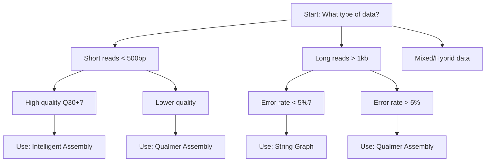

# Assembly Method Selection Guide

*This document is under development. The following sections are planned:*

## Table of Contents

1. [Overview of Assembly Methods](#overview-of-assembly-methods)
2. [Decision Tree](#decision-tree)
3. [Data Type Considerations](#data-type-considerations)
4. [Quality Requirements](#quality-requirements)
5. [Parameter Recommendations](#parameter-recommendations)
6. [Performance Comparisons](#performance-comparisons)
7. [Use Case Examples](#use-case-examples)

## Overview of Assembly Methods

### Available Methods

*TODO: Add detailed method descriptions*

1. **Intelligent Assembly** - Adaptive k-mer progression with error correction
2. **Qualmer Assembly** - Quality-aware probabilistic assembly
3. **String Graph Assembly** - N-gram based approach
4. **External Tool Integration** - SPAdes, Megahit, etc.

## Decision Tree

*TODO: Add interactive decision tree*



## Data Type Considerations

### Short Read Data

*TODO: Add short read recommendations*

- Illumina paired-end
- Quality score requirements
- Coverage recommendations

### Long Read Data  

*TODO: Add long read recommendations*

- PacBio vs Oxford Nanopore
- Error rate handling
- Coverage depth needs

### Hybrid Approaches

*TODO: Add hybrid assembly guidance*

- Combining short and long reads
- Quality-length trade-offs
- Polishing strategies

## Quality Requirements

### Quality Score Thresholds

*TODO: Add quality threshold guidance*

- When quality scores matter
- Minimum quality requirements
- Quality-aware vs quality-agnostic methods

### Coverage Depth

*TODO: Add coverage recommendations*

- Minimum coverage for reliable assembly
- Optimal coverage ranges
- Over-coverage problems

## Parameter Recommendations

### By Data Type

*TODO: Add parameter tables*

| Data Type | Method | Max K | Memory Limit | Quality Threshold |
|-----------|--------|-------|-------------|------------------|
| Illumina 2x150 | Intelligent | 101 | 16GB | 20 |
| PacBio HiFi | String Graph | 51 | 32GB | 15 |
| ONT | Qualmer | 51 | 64GB | 10 |

### Fine-Tuning

*TODO: Add fine-tuning guide*

- K-mer size optimization
- Memory vs accuracy trade-offs
- Error correction parameters

## Performance Comparisons

### Accuracy Benchmarks

*TODO: Add benchmark results*

- Assembly completeness
- Error rates
- Misassemblies

### Runtime Comparisons

*TODO: Add runtime analysis*

- Speed vs accuracy trade-offs
- Memory usage patterns
- Scalability characteristics

## Use Case Examples

### Bacterial Genome Assembly

*TODO: Add bacterial genome example*

```julia
# Recommended approach for bacterial genomes
results = mycelia_assemble(
    "bacterial_reads.fastq",
    max_k=101,
    memory_limit=16_000_000_000
)
```

### Viral Genome Assembly

*TODO: Add viral genome example*

### Metagenome Assembly

*TODO: Add metagenome example*

### Large Genome Assembly

*TODO: Add large genome example*

## Troubleshooting

### Common Issues

*TODO: Add troubleshooting section*

- Assembly fails to complete
- Poor assembly quality
- Memory/performance issues

### When to Switch Methods

*TODO: Add method switching guidance*

- Signs that current method isn't working
- How to try alternative approaches
- Combining results from multiple methods

---

*This guide will be expanded with specific decision criteria, benchmarking results, and detailed parameter recommendations for different use cases.*