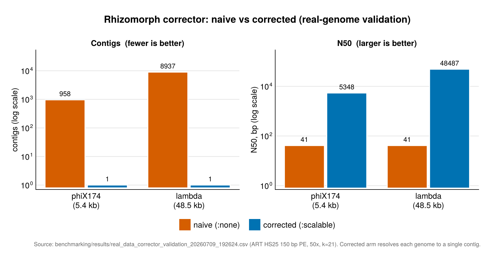
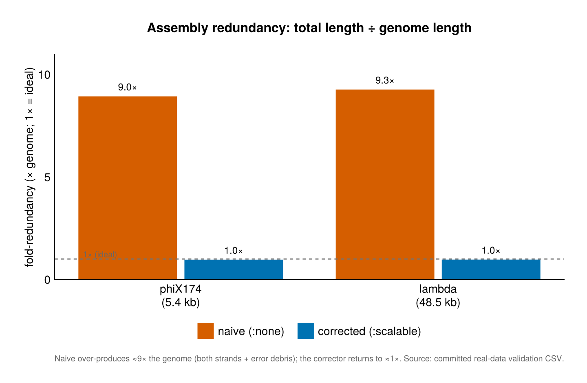

# Benchmarks

## Overview

Comprehensive benchmarks comparing Mycelia's various approaches on different
datasets.

## HPC CI Status

[](https://codecov.io/github/cjprybol/Mycelia?flag=hpc-extended)
[](https://raw.githubusercontent.com/cjprybol/Mycelia/hpc-results/latest-hpc-results.json)
[](https://raw.githubusercontent.com/cjprybol/Mycelia/hpc-results/latest-hpc-results.json)

The lightweight GitHub Actions CI on `master` remains the default merge gate.
Extended HPC validation is published separately from `ci/hpc/run_hpc_ci.sh` via
`bash ci/hpc/publish_hpc_results.sh`, which updates the `hpc-results` branch
with:

- `latest-hpc-results.json` for the full machine-readable run summary
- `latest-tests.json` for the Shields HPC test badge endpoint
- `latest-benchmarks.json` for the Shields HPC benchmark badge endpoint
- `latest-meta.json` for commit, timestamp, and cluster metadata

The raw branch history keeps one archived directory per commit so published
status can be traced back to a specific HPC run without committing bulky logs or
benchmark artifacts to the main repository history.

## Standard Assembler Fixtures

The short-read assembler comparison benchmark now includes two deterministic
fixtures that can be regenerated locally without external downloads:

| Fixture                     | Type       | Description                                                          | Generation              |
| --------------------------- | ---------- | -------------------------------------------------------------------- | ----------------------- |
| `synthetic_isolate_5386`    | Isolate    | Single 5.4 kb synthetic genome for short-read assembly sanity checks | Pure Julia, fixed seed  |
| `synthetic_metagenome_pair` | Metagenome | Two-genome low-complexity community with uneven coverage             | Pure Julia, fixed seeds |

Run the comparison benchmark with:

```bash
julia --project=. benchmarking/assembler_comparison_standard_fixtures.jl
```

This benchmark compares `Mycelia.Rhizomorph.assemble_genome`, `run_megahit`, and
`run_metaspades` on the same generated FASTQ inputs and writes the run plan plus
results as CSV files.

## Rhizomorph H1-H7 Benchmark Harness

The Rhizomorph public-record benchmark surface is defined by
`benchmarking/rhizomorph_benchmark_manifest.toml` and inspected through
`benchmarking/rhizomorph_benchmark_harness.jl`. The manifest inventories the
current reusable benchmark assets:

- deterministic toy controls from `benchmarking/standard_assembler_fixtures.jl`
- repeat-fork calibration from `benchmarking/08_momentum_fork_resolution_benchmark.jl`
- small Rhizomorph graph fixtures in `test/4_assembly/rhizomorph_*_test.jl`
- public isolate references already used by `benchmarking/real_genome_benchmark.jl`
- heterogeneous community candidates such as CAMI, Zymo, and ATCC mock communities

Each manifest dataset records provenance, expected inputs, expected outputs, and
whether it is suitable for CI dry-runs, full public-reference benchmark runs, or
candidate follow-on work. H1-H7 slices route graph construction, k/strand sweeps,
repeat resolution, qualmer robustness, heterogeneous community recovery,
generative sequence fidelity, and external assembler comparisons to their
expected datasets and output tables.

Inspect the harness without running heavy work:

```bash
julia --project=. benchmarking/rhizomorph_benchmark_harness.jl --list-datasets
julia --project=. benchmarking/rhizomorph_benchmark_harness.jl --list-slices
julia --project=. benchmarking/rhizomorph_benchmark_harness.jl --plan --scale ci
julia --project=. benchmarking/rhizomorph_benchmark_harness.jl --slice H2 --slice H7 --scale full
```

The harness is intentionally a dry-run contract today; follow-on implementation
issues should promote each H1-H7 slice from `status = "stub"` to a concrete
runner while preserving the manifest output schema.

## Standardized Test Datasets

To ensure rigorous validation across platforms, Mycelia uses the following
gold-standard communities:

### Mock Communities (Physical & Sequencing)

| Source   | Product                                                                                                                 | Complexity | Description                                        |
| -------- | ----------------------------------------------------------------------------------------------------------------------- | ---------- | -------------------------------------------------- |
| **Zymo** | [D6331](https://www.zymoresearch.com/products/zymobiomics-gut-microbiome-standard)                                      | Medium     | Gut Microbiome Standard (21 strains)               |
| **Zymo** | [D6300](https://www.zymoresearch.com/products/zymobiomics-microbial-community-dna-standard)                             | Low        | Microbial Community Standard (8 bacteria, 2 yeast) |
| **ATCC** | [MSA-1002](https://www.atcc.org/products/msa-1002)                                                                      | Medium     | 20 Strain Even Mix                                 |
| **ATCC** | [MSA-1003](https://www.atcc.org/products/msa-1003)                                                                      | Medium     | 20 Strain Staggered Mix                            |
| **NIST** | [RM 8376](https://www.nist.gov/programs-projects/rm-8376-microbial-pathogen-dna-standards-detection-and-identification) | High       | Microbial Pathogen DNA Standard                    |

### Benchmarking Challenges (Synthetic)

- **CAMI Challenge**:
  [Toy Datasets (Low/Med/High Complexity)](https://cami-challenge.org/datasets/)
- **Genome in a Bottle**:
  [HG002 (Ashkenazi Trio)](https://github.com/genome-in-a-bottle) - Standard for
  variant calling.

### Simulation Targets

For internal testing, we target the following simulation profiles:

- **Depth**: Low (10x), Medium (100x), High (1000x)
- **Diversity**: Isolate, Defined Community (10), Complex Community (100+)
- **Abundance**: Even, Random, Log-normal (staggered)

## Rhizomorph Real Genome Benchmarks

Rhizomorph k-mer sweep assembly was evaluated against six real viral and viroid
reference genomes spanning three orders of magnitude in size. Results were
collected on 2026-03-25 using `benchmarking/real_genome_benchmark.jl`. Each
genome was assembled from the reference sequence directly (no simulated reads)
across k ∈ {11, 15, 21, 25, 31}.

### Genomes tested

| Genome  | Accession | Size (bp) | Type | Tier |
| ------- | --------- | --------- | ---- | ---- |
| PSTVd   | NC_002030 | 359       | RNA  | 1    |
| CCCVd   | NC_003540 | 246       | RNA  | 1    |
| HSVd    | NC_001351 | 297       | RNA  | 1    |
| PhiX174 | NC_001422 | 5,386     | DNA  | 2    |
| Lambda  | NC_001416 | 48,502    | DNA  | 2    |
| T4      | NC_000866 | 168,903   | DNA  | 2    |

### Tier 1 — Viroids (RNA, 246–359 bp)

All three viroids assembled to exactly 2 contigs at every k value tested. Total
assembly length equals 2× the reference, and N50 equals the reference length.
This is the expected single-sequence self-assembly behavior: the k-mer graph
contains both the forward sequence and its reverse complement as separate
Eulerian paths. Runtimes were sub-second for all runs.

| Genome | Ref (bp) | k   | Contigs | Total (bp) | N50 | Runtime (s) |
| ------ | -------- | --- | ------- | ---------- | --- | ----------- |
| PSTVd  | 359      | 11  | 2       | 718        | 359 | 1.25        |
| PSTVd  | 359      | 31  | 2       | 718        | 359 | 1.06        |
| CCCVd  | 246      | 11  | 2       | 798\*      | 399 | 0.006       |
| CCCVd  | 246      | 31  | 2       | 798\*      | 399 | 0.006       |
| HSVd   | 297      | 11  | 2       | 604        | 302 | 0.004       |
| HSVd   | 297      | 31  | 2       | 604        | 302 | 0.004       |

\* The benchmark hardcodes `ref_size=246` for CCCVd but the actual downloaded
NC_003540 sequence is 399 bp; the genome fraction and size comparison columns
used the wrong denominator. The benchmark script has since been updated to
measure actual reference size from the downloaded FASTA rather than relying on
hardcoded values.

### Tier 2 — Bacteriophages (DNA, 5–169 kb)

Assembly quality improves with k for all three phages.

#### PhiX174 (5,386 bp)

Clean assembly (2 contigs, full coverage) at k ≥ 15. At k = 11 the graph is
fragmented into 46 contigs due to abundant short repeats at that resolution.

| k   | Contigs | Total (bp) | N50   | Runtime (s) |
| --- | ------- | ---------- | ----- | ----------- |
| 11  | 46      | 11,180     | 501   | 1.48        |
| 15  | 2       | 10,772     | 5,386 | 1.12        |
| 21  | 2       | 10,772     | 5,386 | 1.17        |
| 25  | 2       | 10,772     | 5,386 | 1.10        |
| 31  | 2       | 10,772     | 5,386 | 1.29        |

#### Lambda phage (48,502 bp)

Full-length assembly (2 contigs) achieved at k ≥ 21. At k = 11 the graph
shatters into 2,670 contigs; k = 15 reduces this to 21 with N50 of 9.3 kb.

| k   | Contigs | Total (bp) | N50    | Runtime (s) |
| --- | ------- | ---------- | ------ | ----------- |
| 11  | 2,670   | 121,237    | 61     | 557         |
| 15  | 21      | 97,257     | 9,346  | 214         |
| 21  | 2       | 97,004     | 48,502 | 244         |
| 25  | 2       | 97,004     | 48,502 | 176         |
| 31  | 2       | 97,004     | 48,502 | 233         |

#### T4 phage (168,903 bp)

T4 remains fragmented at all k values due to its extensive repetitive elements.
Assembly quality improves steadily with k, reaching 17 contigs and N50 of 27 kb
at k = 31. Full contiguity will require repeat-aware strategies or longer k
values.

| k   | Contigs | Total (bp) | N50    | Runtime (s) |
| --- | ------- | ---------- | ------ | ----------- |
| 11  | 10,981  | 264,030    | 27     | 1,415       |
| 15  | 219     | 171,289    | 1,693  | 1,262       |
| 21  | 39      | 169,366    | 9,740  | 778         |
| 25  | 25      | 169,246    | 23,384 | 816         |
| 31  | 17      | 169,195    | 27,046 | 1,205       |

### Known limitations in this benchmark

- **GC content** is reported as 0.0 for all genomes due to a type mismatch in
  `assembly_metrics` when working with `String`-typed Rhizomorph contigs. This
  does not affect contiguity or length metrics.
- **Genome fraction** exceeds 100 % for single-sequence inputs because
  Rhizomorph self-assembly produces both the forward and reverse-complement
  paths; QUAST counts both against the reference.
- Runtimes reflect wall time on a single laptop core and include NCBI download
  overhead for the download phase.

To reproduce:

```bash
julia --project=. benchmarking/real_genome_benchmark.jl --tier 2
```

Raw CSV results are archived under
`benchmarking/results/real_genome_benchmark_*.csv`.

## Rhizomorph Corrector Validation (Real Data)

Rhizomorph ships an opt-in **read corrector** — a graph-structured hidden Markov
model that decodes each read to its maximum-likelihood path before assembly (see
`docs/design/2026-07-graph-as-hmm-corrector-methods.md` and
[Tutorial 13b](generated/tutorials/13_rhizomorph_corrector.md)). This section validates the production
`:scalable` tier on real genomes, contrasting two arms on identical reads:

- **naive** — `assemble_genome(reads; corrector=:none, k=21)`
- **scalable** — `assemble_genome(reads; corrector=:iterative, strategy=:scalable, k=21)`

Both arms use the `DoubleStrand` graph mode.

### Provenance

- Reads are simulated **from the real reference** with ART's HS25 (HiSeq 2500)
  empirical error model, 150 bp paired-end, 50× coverage. `sra-tools` is
  unavailable in the build environment, so true SRA reads are not downloaded;
  the reads carry realistic Illumina error/quality against real genome structure.
- Reference-based metrics come from MUMmer `dnadiff` (genome fraction, identity,
  mismatch/indel rates). QUAST's bioconda build does not solve on osx-arm64, so a
  local `dnadiff` parser is used.

### Results

| Genome  | Arm      | Contigs | N50 (bp)   | Genome fraction | Avg identity | Mismatches/100 kb | Runtime (s) |
| ------- | -------- | ------- | ---------- | --------------- | ------------ | ----------------- | ----------- |
| phiX174 | naive    | 958     | 41         | 99.83 %         | 99.98 %      | 18.6              | 3.7         |
| phiX174 | scalable | **1**   | **5,348**  | 99.29 %         | 100.0 %      | 0.0               | 18.1        |
| lambda  | naive    | 8,937   | 41         | 99.99 %         | 100.0 %      | 0.0               | 36.1        |
| lambda  | scalable | **1**   | **48,487** | 99.97 %         | 99.99 %      | 8.2               | 344.2       |



The naive short-read assembly fragments each genome into hundreds to thousands of
redundant contigs (N50 = 41 bp; total length roughly 9× the genome, since each
strand and its error debris assemble separately). The `:scalable` corrector
collapses these into a **single near-full-length contig** while holding genome
fraction at 99.3–100 % and identity at 99.99–100 %.

The same result viewed as assembly redundancy — total assembled length relative
to the genome length. The naive arm carries ≈9× the genome (both strands plus
error debris); the corrector returns to ≈1× (a single near-full-length contig).



### Trade-offs and caveats

- **Runtime.** Correction adds a per-read maximum-likelihood decode, so the
  corrected arm is slower (≈5–10× here). The corrector's residual runtime scaling
  is under active reduction, so these wall-clock figures are a current snapshot,
  not an optimized ceiling.
- These are real genomes (real repeat/GC structure) but simulated reads; treat
  the numbers as engineering validation of the pipeline, not a head-to-head study
  against external assemblers.

To reproduce:

```bash
julia --project=. benchmarking/real_data_corrector_validation.jl
```

Raw CSV results are archived under
`benchmarking/results/real_data_corrector_validation_*.csv`.

## Coming Soon

- Assembler comparison results across Rhizomorph, MEGAHIT, and metaSPAdes on the
  standard synthetic fixtures
- Memory usage profiling for large-genome assemblies
- Accuracy assessments against Genome in a Bottle reference calls

For current benchmarking code, see the
[benchmarking directory](https://github.com/cjprybol/Mycelia/tree/main/benchmarking)
in the repository.

## Related Documentation

- [Workflow Map](workflow-map.md)
- [Metagenomic Workflow](metagenomic-workflow.md)
