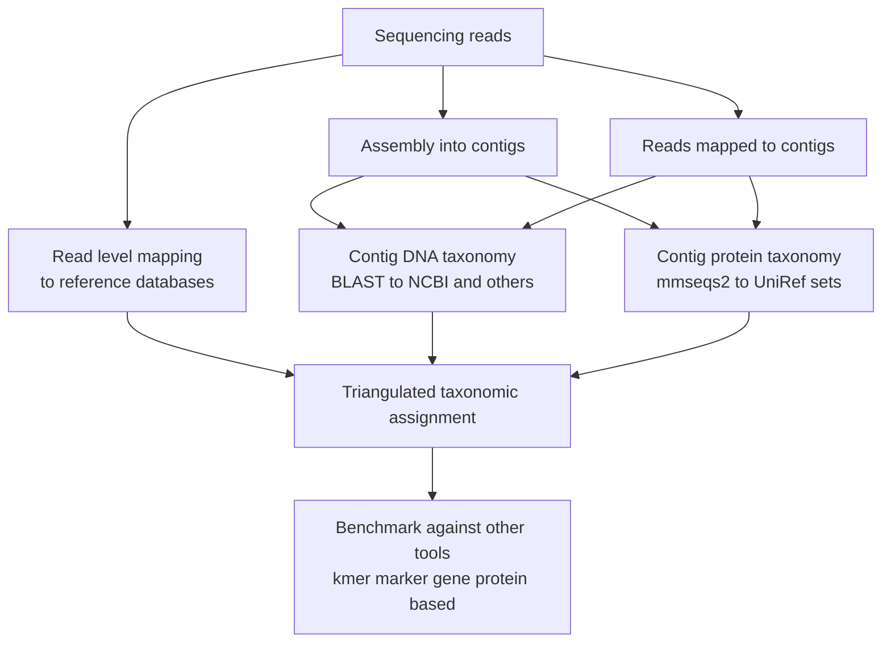
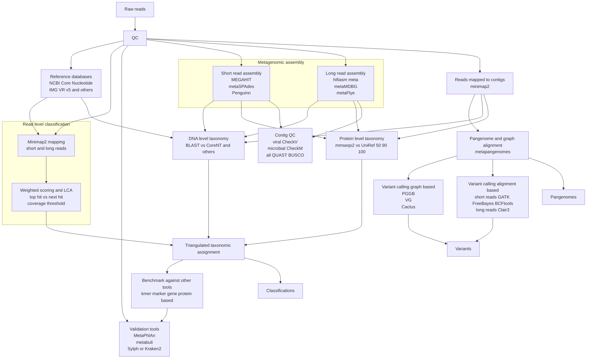

# Metagenomic Analysis Workflow

This document describes the metagenomic analysis workflow implemented in Mycelia, including read-level classification, assembly, taxonomy assignment, and validation strategies.

## Overview

The Mycelia metagenomic workflow implements a triangulated approach to taxonomic classification, combining evidence from multiple sources:

1. **Read-level classification** - Direct mapping of reads to reference databases
2. **Contig-level DNA taxonomy** - BLAST-based classification of assembled contigs
3. **Contig-level protein taxonomy** - MMseqs2-based classification against UniRef databases

## Full Workflow

The complete metagenomic workflow includes quality control, multiple assembly strategies, variant calling, and pangenome analysis:

## Workflow Components

### Quality Control

Initial read quality assessment and filtering using:
- FastQC for quality metrics
- Adapter trimming and quality filtering

### Read-Level Classification

Direct classification of reads using minimap2 mapping against reference databases, with weighted scoring based on:
- Top hit vs next hit ratio
- Coverage thresholds
- LCA (Lowest Common Ancestor) assignment for ambiguous mappings

### Assembly Strategies

**Short Read Assembly:**
- MEGAHIT - memory-efficient assembly
- metaSPAdes - metagenome-specific assembly
- Penguinn - guided assembly with protein references

**Long Read Assembly:**
- hifiasm-meta - HiFi metagenome assembly
- metaMDBG - minimizer-based assembly
- metaFlye - long-read metagenome assembly

### Taxonomy Assignment

**DNA-level:**
- BLAST against NCBI Core Nucleotide
- Custom reference databases

**Protein-level:**
- MMseqs2 against UniRef50, UniRef90, UniRef100
- Sensitive homology detection for divergent sequences

### Quality Control and Validation

**Viral contigs:**
- CheckV for completeness and contamination

**Microbial contigs:**
- CheckM/CheckM2 for completeness and contamination

**General:**
- QUAST for assembly statistics
- BUSCO for completeness assessment

### Variant Calling

**Graph-based:**
- PGGB (PanGenome Graph Builder)
- VG toolkit
- Cactus

**Alignment-based:**
- Short reads: GATK HaplotypeCaller, FreeBayes, BCFtools
- Long reads: Clair3

## Integration with Rhizomorph

The Mycelia workflow integrates with the Rhizomorph graph-based assembly system to:
- Build k-mer graphs from sequencing reads
- Perform probabilistic assembly
- Validate assemblies through graph traversal
- Compare traditional assembly methods with graph-based approaches

## Tool Status

See the [Tool Wrapper Status](../planning-docs/TOOL_WRAPPER_STATUS.md) document for current implementation status of each tool wrapper.
See the [Tool Wrapper Status](https://github.com/cjprybol/Mycelia/blob/main/planning-docs/TOOL_WRAPPER_STATUS.md) document for current implementation status of each tool wrapper.
