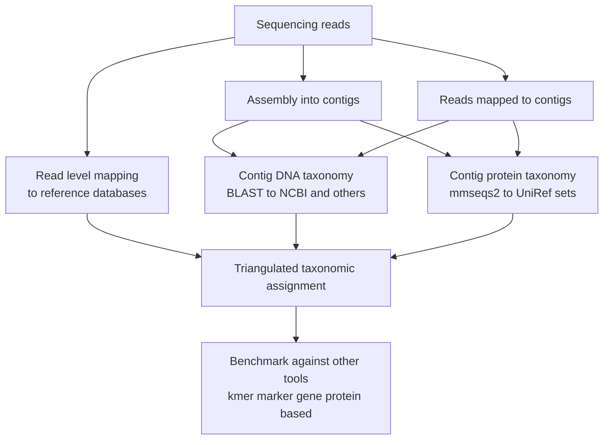

# Metagenomic Analysis Workflow

This document describes the metagenomic analysis workflow implemented in Mycelia, including read-level classification, assembly, taxonomy assignment, and validation strategies.

## Overview

The Mycelia metagenomic workflow implements a triangulated approach to taxonomic classification, combining evidence from multiple sources:

1. **Read-level classification** - Direct mapping of reads to reference databases
2. **Contig-level DNA taxonomy** - BLAST-based classification of assembled contigs
3. **Contig-level protein taxonomy** - MMseqs2-based classification against UniRef databases



## Full Workflow

The complete metagenomic workflow includes quality control, multiple assembly strategies, variant calling, and pangenome analysis:

```mermaid
flowchart TD
  R[Raw reads] --> Q[QC<br/>FastQC<br/>fastp (short)<br/>fastplong (long)<br/>filtlong / chopper (long)<br/>trim_galore (Illumina PE)]

  Q --> DBs[Reference databases<br/>NCBI Core Nucleotide<br/>IMG VR v5 and others]

  Q --> RL_map
  subgraph RL [Read level classification]
    direction TB
    RL_map[Minimap2 mapping<br/>short and long reads] --> RL_score[Weighted scoring and LCA<br/>top hit vs next hit<br/>coverage threshold]
  end
  DBs --> RL_map

  Q --> RL_val[Validation tools / profiling<br/>sourmash<br/>MetaPhlAn<br/>Metabuli<br/>Sylph<br/>Kraken / Kraken2<br/>CoverM]

  Q --> SR_asm
  Q --> LR_asm
  subgraph ASM [Metagenomic assembly]
    direction LR
    SR_asm[Short read assembly<br/>MEGAHIT<br/>metaSPAdes<br/>MetaVelvet<br/>PenguiN]
    LR_asm[Long read assembly<br/>myloasm<br/>hifiasm meta (hifiasm-meta)<br/>metaMDBG (metamdbg)<br/>metaFlye (metaflye)]
  end

  SR_asm --> Bin[Binning]
  LR_asm --> Bin
  subgraph BIN [Binning & Refinement]
    direction TB
    Bin --> B1[MetaBAT / MetaBAT2]
    Bin --> B2[MaxBin]
    Bin --> B3[VAMB / GenomeFace]
    B1 --> Cons[DAS Tool Refinement]
    B2 --> Cons
    B3 --> Cons
  end
  Cons --> MAGs[MAGs]
  MAGs --> Drep[De-replication<br/>dRep, galah]
  MAGs --> MAGtax[Bin taxonomy assignment<br/>(BLAST / mmseqs2)]
  MAGtax --> MAGqc_micro[Microbial MAG QC<br/>CheckM2]
  MAGtax --> MAGqc_viral[Viral MAG QC<br/>CheckV, geNomad]
  MAGqc_micro --> Drep
  MAGqc_viral --> Drep
  Drep --> Clust[Similarity / clustering<br/>FastANI, skani<br/>mash, dashing2<br/>BLAST]

  SR_asm --> Phasing[Strain Phasing]
  LR_asm --> Phasing
  subgraph STR [Strain Resolution]
    direction TB
    Phasing --> S1[Floria / Strainy]
    Phasing --> S2[STRONG / HyLight]
  end

  SR_asm --> DNA_tax
  LR_asm --> DNA_tax
  DBs --> DNA_tax
  DNA_tax[DNA level taxonomy<br/>BLAST vs CoreNT and others]

  SR_asm --> Prot_tax
  LR_asm --> Prot_tax
  Prot_tax[Protein level taxonomy<br/>mmseqs2 vs UniRef 50 90 100]

  Q --> MapAsm[Reads mapped to contigs<br/>minimap2]
  MapAsm --> CovQC[Coverage QC<br/>mosdepth, qualimap<br/>CoverM]
  MapAsm --> Pangraph[Pangenome and graph alignment<br/>metapangenomes]
  Pangraph --> VarPan[Variant calling graph based<br/>PGGB<br/>VG<br/>Cactus]
  Pangraph --> VarAlign[Variant calling alignment based<br/>short reads GATK FreeBayes BCFtools<br/>long reads Clair3]

  MapAsm --> DNA_tax
  MapAsm --> Prot_tax

  SR_asm --> QCcontig
  LR_asm --> QCcontig
  QCcontig[Assembly QC (contigs)<br/>QUAST / metaQUAST, BUSCO<br/>viral CheckV, geNomad<br/>microbial CheckM / CheckM2]
  CovQC --> QCcontig

  RL_score --> Tri[Triangulated taxonomic assignment]
  DNA_tax --> Tri
  Prot_tax --> Tri

  Tri --> Bench[Benchmark against other tools<br/>kmer marker gene protein based]
  Bench --> RL_val

  Tri --> C[Classifications]
  VarPan --> V[Variants]
  VarAlign --> V[Variants]
  Pangraph --> P[Pangenomes]
```

## Workflow Variants (Short, Long, Hybrid)

The "Full Workflow" diagram above shows all major components. In practice, users typically follow one of the read-type-specific variants below, then optionally converge on common downstream steps (assembly QC, binning, post-binning QC, dereplication, strain resolution, variants/pangenomes).

### Short-Read Only (Illumina)

```mermaid
flowchart TD
  SR[Short reads (Illumina)] --> QC[QC<br/>FastQC<br/>fastp / trim_galore]
  QC --> Prof[Profiling / validation (reads)<br/>sourmash, MetaPhlAn, Metabuli, Sylph, Kraken]
  QC --> Asm[Short-read assembly<br/>MEGAHIT, metaSPAdes, MetaVelvet]

  Asm --> Contigs[Contigs]
  QC --> Map[Map reads<br/>to contigs or references<br/>minimap2]
  Map --> Cov[Coverage QC<br/>mosdepth, qualimap, CoverM]
  Contigs --> Assess[Assembly assessment<br/>QUAST / metaQUAST, BUSCO]
  Cov --> Assess

  Map --> Var[Variant calling (short)<br/>GATK, FreeBayes, BCFtools]
  Var --> VCF[VCF]

  Assess --> Bin[Binning<br/>MetaBAT2, MaxBin, VAMB, GenomeFace,<br/>MetaCoAG, COMEBin, TaxVAMB]
  Bin --> MAGs[MAGs]
  MAGs --> Tax[Bin taxonomy<br/>BLAST / mmseqs2]
  Tax --> Micro[Microbial QC<br/>CheckM2]
  Tax --> Viral[Viral QC<br/>CheckV, geNomad]
  Micro --> Catalog[Curated MAG set]
  Viral --> Catalog
  Catalog --> Drep[De-replication/merging<br/>dRep, MAGmax]
  Drep --> Clust[Similarity/clustering<br/>skani, FastANI, mash]
```

### Long-Read Only (ONT / PacBio)

```mermaid
flowchart TD
  LR[Long reads (ONT / PacBio)] --> QC[QC<br/>FastQC<br/>fastplong / filtlong / chopper]
  QC --> Prof[Profiling / validation (reads)<br/>sourmash, MetaPhlAn, Metabuli, Sylph, Kraken]
  QC --> Asm[Long-read assembly<br/>metaflye, metamdbg, hifiasm-meta, myloasm]

  Asm --> Contigs[Contigs]
  QC --> Map[Map reads<br/>to contigs or references<br/>minimap2]
  Map --> Cov[Coverage QC<br/>mosdepth, qualimap, CoverM]
  Contigs --> Assess[Assembly assessment<br/>QUAST / metaQUAST, BUSCO]
  Cov --> Assess

  Map --> Var[Variant calling (long)<br/>Clair3]
  Var --> VCF[VCF]

  Assess --> Bin[Binning<br/>MetaBAT2, MaxBin, VAMB, GenomeFace,<br/>MetaCoAG, COMEBin, TaxVAMB]
  Bin --> MAGs[MAGs]
  MAGs --> Tax[Bin taxonomy<br/>BLAST / mmseqs2]
  Tax --> Micro[Microbial QC<br/>CheckM2]
  Tax --> Viral[Viral QC<br/>CheckV, geNomad]
  Micro --> Catalog[Curated MAG set]
  Viral --> Catalog
  Catalog --> Drep[De-replication/merging<br/>dRep, MAGmax]
  Drep --> Clust[Similarity/clustering<br/>skani, FastANI, mash]
```

### Hybrid (Short + Long)

```mermaid
flowchart TD
  SR[Short reads] --> QC1[QC (short)<br/>FastQC<br/>fastp / trim_galore]
  LR[Long reads] --> QC2[QC (long)<br/>FastQC<br/>fastplong / filtlong / chopper]
  QC1 --> Asm[Hybrid or combined assembly<br/>unicycler (hybrid)<br/>or separate SR/LR assembly]
  QC2 --> Asm

  Asm --> Contigs[Contigs]
  QC1 --> Map[Map reads<br/>to contigs or references<br/>minimap2]
  QC2 --> Map
  Map --> Cov[Coverage QC<br/>mosdepth, qualimap, CoverM]
  Contigs --> Assess[Assembly assessment<br/>QUAST / metaQUAST, BUSCO]
  Cov --> Assess

  Map --> VarSR[Variant calling (short)<br/>GATK, FreeBayes, BCFtools]
  Map --> VarLR[Variant calling (long)<br/>Clair3]
  VarSR --> VCF[VCF]
  VarLR --> VCF
```

## Workflow Components

### Quality Control

Initial read quality assessment and filtering using:
- FastQC for quality metrics
- Adapter trimming and quality filtering
- `fastp` - Short-read QC, trimming, filtering, reports
- `fastplong` - Long-read QC, trimming, filtering, reports (fastp-long)
- `filtlong` - Long-read filtering
- `chopper` - Long-read filtering
- `trim_galore` - Illumina adapter trimming for paired-end reads

### Read-Level Classification

Direct classification of reads using minimap2 mapping against reference databases, with weighted scoring based on:
- Top hit vs next hit ratio
- Coverage thresholds
- LCA (Lowest Common Ancestor) assignment for ambiguous mappings

### Taxonomic Profiling
**Containment & Estimation:**
* `sourmash` - Fast search and containment estimation using MinHash sketches

**Profiling & Classification:**
* `CoverM` - Read coverage calculator
* `MetaPhlAn` - Marker gene-based profiling
* `Sylph` - Precision profiling for metagenomes
* `Metabuli` - DNA/Amino acid joint analysis
* `Kraken` - Exact k-mer classification

### Sketch-Guided Pangenome Context Selection
Use k-mer sketching against reference assemblies, sample reads, and pangenome reference paths to
identify which contexts are present, then subset the reference set before mapping.

- `mash` and `sourmash` containment and `sylph` coverage highlight supported contexts.
- `mash` and `skani` distances can prune/cluster distant references when needed.
- Use `select_sketch_supported_references` to keep the best-supported paths.
- Map reads with `minimap2` against the filtered references for downstream QC/variants.

### Assembly Strategies

**Short Read Assembly:**
- MEGAHIT - memory-efficient assembly (iterative de Bruijn graph)
- metaSPAdes - metagenome-specific assembly (high-quality short-read assembly)
- PenguiN - guided assembly with protein references
- MetaVelvet - extension of Velvet for metagenomics

**Long Read Assembly:**
- myloasm - plasmid-aware assembly
- hifiasm-meta - HiFi metagenome assembly
- metaMDBG / metamdbg - minimizer-space de Bruijn graph assembly
- metaFlye / metaflye - long-read metagenome assembly

**Hybrid / Other Assemblers (also available in Mycelia, depending on your inputs):**
- Unicycler (hybrid short+long)
- SPAdes, SKESA, Velvet
- Flye, Canu, Hifiasm

### Taxonomy Assignment

**DNA-level:**
- BLAST against NCBI Core Nucleotide
- Custom reference databases

**Protein-level:**
- MMseqs2 against UniRef50, UniRef90, UniRef100
- DIAMOND as a fast protein search alternative (where appropriate)
- Sensitive homology detection for divergent sequences

### Taxonomy-Aware ORF Calling

Once contigs are classified, use the NCBI taxonomy graph to choose the correct translation
table before calling ORFs with Prodigal or Pyrodigal.

```julia
ncbi_taxonomy = Mycelia.load_ncbi_taxonomy()
tax_id = 562
table_id = Mycelia.get_ncbi_genetic_code(ncbi_taxonomy, tax_id)

orf_calls = Mycelia.run_pyrodigal(
    fasta_file=contig_fasta,
    out_dir="orf_calls",
    translation_table=table_id
)
```

Use `type=:mitochondrial` when working with mitochondrial contigs.

### Quality Control and Validation

**Assembly QC by read mapping:**
- Map reads back to contigs with `minimap2` and compute coverage
- `mosdepth` - Depth/coverage summaries from BAM/CRAM
- `qualimap` - Alignment/QC reports from BAM
- `CoverM` - Per-contig and per-genome/bin coverage/abundance tables

**Assembly assessment:**
- QUAST / metaQUAST for assembly statistics (metagenome mode when appropriate)
- BUSCO for completeness assessment

**Viral contigs:**
- CheckV for completeness and contamination
- geNomad for viral/mobile element identification (viruses/plasmids)

**Microbial contigs:**
- CheckM/CheckM2 for completeness and contamination

**General:**
- QUAST for assembly statistics
- BUSCO for completeness assessment

### Binning & Refinement
* `DAS Tool` - Consensus binning refinement
* `MetaBAT` / `MetaBAT2` - Tetranucleotide frequency binning
* `GenomeFace` - Deep learning-based binning
* `MaxBin` - Expectation-maximization algorithm
* `MetaCoAG` - Graph- and coverage-aware binning
* `COMEBin` - Ensemble binning / refinement
* `TaxVAMB` - Taxonomy-guided VAMB variant
* `Taxometer` - Taxonomy-aware binning support
* `VAMB` - Variational Autoencoder Microbial Binner
* Wrapper functions available in `src/binning.jl` (e.g., `run_metabat2`, `run_vamb`, `run_taxvamb`, `run_taxometer`, `run_metacoag`, `run_genomeface`, `run_comebin`)

### Post-binning QC (MAGs)
After binning, apply QC based on the bin’s classification/expected biology:
* **Microbial MAGs**: `CheckM2` (and optionally legacy `CheckM`)
* **Viral MAGs / viral contigs**: `CheckV` and `geNomad`

### Reference Databases
Mycelia integrates with high-quality public registries for taxonomic assignment:
* **Microbial**: GTDB, NCBI RefSeq Prokaryota (`ref_prok_rep_genomes`)
* **Viral**: IMG/VR v5, NCBI RefSeq Viral (`ref_viruses_rep_genomes`)
* **Plasmids**: [PLSDB](https://ccb-microbe.cs.uni-saarland.de/plsdb2025/), NCBI Plasmid RefSeq
* **Protein**: UniProt (SwissProt/TrEMBL), UniRef100/90/50

### Similarity, Clustering & De-replication
* `FastANI` - Fast Whole-Genome Similarity (ANI)
* `skani` - Fast ANI for metagenomic-assembled genomes (MAGs)
* `dashing2` - HyperLogLog sketching for distance estimation
* `galah` - Representative genome selection (dereplication)
* `dRep` - Genome de-replication pipeline
* `mash` - MinHash distance estimation
* `Blast` - Pairwise Blast-based ANI

### Strain-Level Phasing
* `Floria` - Strain-aware assembly/phasing
* `Strainy` - Phasing from metagenomic reads
* `STRONG` - Strain Resolution ON Graphs
* `HyLight` - Hybrid assembly graph phasing

### Variant Calling

**Graph-based:**
- PGGB (PanGenome Graph Builder)
- VG toolkit
- Cactus

**Alignment-based:**
- Short reads: GATK HaplotypeCaller, FreeBayes, BCFtools
- Long reads: Clair3

## Tool Inputs → Outputs (Quick Reference)

This section answers: “what does a tool consume (reads/contigs/bins/BAM) and what does it produce?” For the broader repository-wide inventory (including many non-metagenomic utilities), see `docs/src/workflow-map.md`.

| Stage | Tool(s) | Input | Output | Notes |
| --- | --- | --- | --- | --- |
| Read QC (short) | FastQC, fastp, Trim Galore | Illumina FASTQ | Filtered/trimmed FASTQ + HTML/JSON | Wrapped: `run_fastqc`, `qc_filter_short_reads_fastp`, `trim_galore_paired` |
| Read QC (long) | FastQC, fastplong, Filtlong, Chopper | ONT/PacBio FASTQ | Filtered FASTQ + QC reports | Wrapped: `qc_filter_long_reads_fastplong`, `qc_filter_long_reads_filtlong`, `qc_filter_long_reads_chopper` |
| Read profiling | sourmash, MetaPhlAn, Metabuli, Sylph | FASTQ reads | Taxonomic profiles/reports | Wrapped: `run_sourmash_*`, `run_metaphlan`, `run_metabuli_classify`, `run_sylph_profile` |
| Read profiling (k-mer exact) | Kraken / Kraken2 | FASTQ reads | Classification reports | Parser exists (`parse_kraken_report`); runner wrapper not present in `src/` yet |
| Read/contig mapping | minimap2 | Reads + contigs/reference | SAM/BAM | Wrapped: `minimap_map*` helpers |
| Coverage QC | mosdepth, Qualimap, CoverM | BAM/CRAM | Coverage tables + reports | Wrapped: `run_mosdepth`, `run_qualimap_bamqc`, `run_coverm_contig`, `run_coverm_genome` |
| Assembly assessment | QUAST / metaQUAST, BUSCO | Assembly FASTA | QC summary tables + reports | Wrapped: `run_quast`, `run_busco` |
| Assembly QC (microbial) | CheckM2 | Microbial assemblies/bins | Completeness/contamination metrics | Wrapped: `run_checkm2` |
| Assembly QC (viral) | CheckV, geNomad | Viral contigs/bins | Viral QC + viral/mobile element calls | Wrapped: `run_checkv`, `run_genomad` |
| Assembly (short) | MEGAHIT, metaSPAdes, MetaVelvet | Short reads | Contigs FASTA | Wrapped: `run_megahit`, `run_metaspades`, `run_metavelvet` |
| Assembly (short, option) | PenguiN | Short reads | Contigs FASTA | Wrapped: `run_penguin_nuclassemble`, `run_penguin_guided_nuclassemble` |
| Assembly (long) | metaFlye, metaMDBG, hifiasm-meta | Long reads | Contigs FASTA | Wrapped: `run_metaflye`, `run_metamdbg`, `run_hifiasm_meta` |
| Assembly (long, option) | myloasm | Long reads | Contigs FASTA | Mentioned as an option; runner wrapper not present in `src/` yet |
| Assembly (hybrid) | Unicycler | Short + long reads | Contigs FASTA | Wrapped: `run_unicycler` |
| Polishing / error correction | Apollo, Homopolish | Assembly FASTA + reads | Polished assembly FASTA | Wrapped: `run_apollo`, `run_homopolish` |
| Contig/MAG taxonomy | BLAST, MMseqs2, DIAMOND | Contigs/MAGs + databases | Hit tables + assignments | Wrapped: `run_mmseqs_search`, `run_blast*`, `run_diamond_search` (see `docs/src/workflow-map.md`) |
| Binning | MetaBAT2, MaxBin, VAMB, GenomeFace, MetaCoAG, COMEBin, TaxVAMB, Taxometer | Contigs + depth/coverage tables | MAG/bin FASTAs + bin tables | Wrapped: `src/binning.jl` runners |
| Post-binning | dRep, MAGmax | MAG/bin FASTAs / bin sets | Dereplicated/merged catalogs | Wrapped: `run_drep_dereplicate`, `run_magmax_merge` |
| Similarity/clustering | skani, FastANI, mash | Assemblies/MAGs | Distance/ANI tables | Wrapped: `skani_dist`, `skani_triangle`, `fastani_*`, `run_mash_comparison` |
| Similarity/clustering (options) | dashing2, galah | Assemblies/MAGs | Distance tables / representative sets | Mentioned as options; runner wrappers not present in `src/` yet |
| Strain resolution | Floria, Strainy, STRONG, HyLight | Reads + contigs/graphs (tool-specific) | Strain-resolved assemblies/paths | Runner wrappers exist in `src/assembly.jl` (tests may be opt-in/commented) |
| Variants (short) | GATK, FreeBayes, BCFtools | BAM + reference FASTA | VCF | Wrapped in `src/variant-analysis.jl` |
| Variants (long) | Clair3 | BAM + reference FASTA | VCF | Wrapped in `src/variant-analysis.jl` |
| Pangenomes | PGGB, VG, Cactus | Assemblies | Pangenome graphs + alignments | Wrapped in pangenome modules (see `docs/src/workflow-map.md`) |

## Integration with Rhizomorph

The Mycelia workflow integrates with the Rhizomorph graph-based assembly system to:
- Build k-mer graphs from sequencing reads
- Perform probabilistic assembly
- Validate assemblies through graph traversal
- Compare traditional assembly methods with graph-based approaches

## Tool Status

See the [Tool Wrapper Status](https://github.com/cjprybol/Mycelia/blob/main/planning-docs/TOOL_WRAPPER_STATUS.md) document for current implementation status of each tool wrapper.
