# Probabilistic Assembly with Mycelia

Mycelia's probabilistic assembly approach combines probabilistic modelling with biological insight to deliver assemblies with confidence intervals.

## 🧬 What is Probabilistic Assembly?

### Traditional Assembly
Traditional assemblers make **deterministic decisions** at each step:
- Fixed k-mer size throughout assembly
- Binary decisions: keep or discard sequences
- Quality scores often ignored after initial filtering
- Heuristic-based error correction

### Probabilistic Assembly
Mycelia's probabilistic approach treats assembly as a **statistical inference problem**:
- Dynamic k-mer progression based on data characteristics
- Probabilistic path selection using quality scores
- Maximum likelihood error correction
- Self-optimizing parameters through machine learning

```
Traditional:  Reads → Graph → Heuristic Cleaning → Assembly
Probabilistic: Reads → Quality-Aware Graph → Statistical Inference → Optimal Assembly
```

## 🎯 Why Use Probabilistic Assembly?

### 1. **High Accuracy**
- Preserves quality information throughout assembly
- Statistically principled error correction

### 2. **Self-Optimizing**
- No manual parameter tuning required
- Automatically selects optimal k-mer sizes
- Adapts to your data's characteristics

### 3. **Quality-Aware**
- First assembler to preserve per-base quality scores
- Handles varying coverage gracefully

## 🚀 Quick Start (5 Minutes)

Get your first assembly running in under 5 minutes:

```julia
# 1. Install Mycelia (one-time setup)
import Pkg
Pkg.add(url="https://github.com/cjprybol/Mycelia.git")

# 2. Load the package
import Mycelia

# 3. Assemble your genome
assembly = Mycelia.assemble_genome("my_reads.fastq")

# 4. Check your results
println("Assembly complete! $(assembly.num_contigs) contigs, N50: $(assembly.n50)")

# 5. Save the assembly
Mycelia.write_fasta(assembly.contigs, "my_assembly.fasta")
```

That's it! Mycelia automatically:
- ✓ Detects your data type
- ✓ Selects optimal parameters
- ✓ Performs quality-aware assembly
- ✓ Validates results

## 🗺️ Choose Your Path

### By Data Type

```mermaid
graph TD
    A[What type of data do you have?] --> B[FASTA only<br/>No quality scores]
    A --> C[FASTQ<br/>With quality scores]
    A --> D[Mixed<br/>Short + long reads]
    
    B --> E[K-mer Graphs<br/>→ Tutorial 1]
    C --> F[Qualmer Graphs<br/>→ Tutorial 2]
    D --> G[Hybrid Assembly<br/>→ Tutorial 3]
```



### By Experience Level

#### 🌱 **Beginner** - "I just want it to work"
→ Start with [Assembly in 5 Minutes](../../tutorials/00_assembly_in_5_minutes.jl)
- Automatic parameter selection
- Simple one-function interface
- Clear output interpretation

#### 🌿 **Intermediate** - "I want to understand and optimize"
→ Continue to [Understanding Assembly Methods](assembly-method-selection.md)
- Compare different approaches
- Tune for your specific needs
- Interpret quality metrics

#### 🌳 **Advanced** - "I want full control"
→ Explore [Advanced Assembly Theory](theoretical-foundations.md)
- Custom graph algorithms
- Machine learning integration
- Novel method development

## 📊 Each Method

### Intelligent Assembly
- ✅ Automatic parameter optimization
- ✅ Good for unknown data characteristics
- ✅ Balances speed and accuracy

### Iterative Assembly
- ✅ Best for low-quality data
- ✅ Refines assembly through iterations
- ⏱️ Takes more time

### Reinforcement Learning Assembly
- ✅ Learns from experience
- ✅ Adapts to new data types
- 🧪 Experimental feature

## 🛠️ Next Steps

### Ready to Start?
1. **[Install Mycelia](getting-started.md#installation)** - Multiple installation options
2. **[Run the 5-minute tutorial](../../tutorials/00_assembly_in_5_minutes.jl)** - See it in action
3. **[Choose your workflow](assembly-method-selection.md)** - Find the best approach

### Need Help?
- 📖 **[FAQ](faq.md)** - Common questions and troubleshooting
- 💬 **[Community Forum](https://github.com/cjprybol/Mycelia/discussions)** - Ask questions
- 🐛 **[Report Issues](https://github.com/cjprybol/Mycelia/issues)** - Help us improve

### Want to Learn More?
- 🧮 **[Mathematical Foundations](theoretical-foundations.md)** - The theory behind the methods
- 📊 **[Benchmarks](benchmarks.md)** - Performance comparisons
- 🔬 **[Case Studies](case-studies.md)** - Real-world applications

## 🌟 Why Mycelia?

### Scientific Innovation
- **Novel 6-graph hierarchy** - Unifies multiple assembly approaches
- **Quality preservation** - First to maintain quality throughout assembly
- **Principled algorithms** - Based on proven statistical methods

### Practical Benefits
- **No parameter tuning** - It should just work
- **Transparent results** - Data-driven accuracy and completeness
- **Active development** - Regular updates and improvements

### Open Source
- **Free to use** - MIT licensed
- **Community driven** - Contributions welcome
- **Transparent** - All algorithms documented

---

Ready to experience the future of genome assembly? [Get started now →](../../tutorials/00_assembly_in_5_minutes.jl)