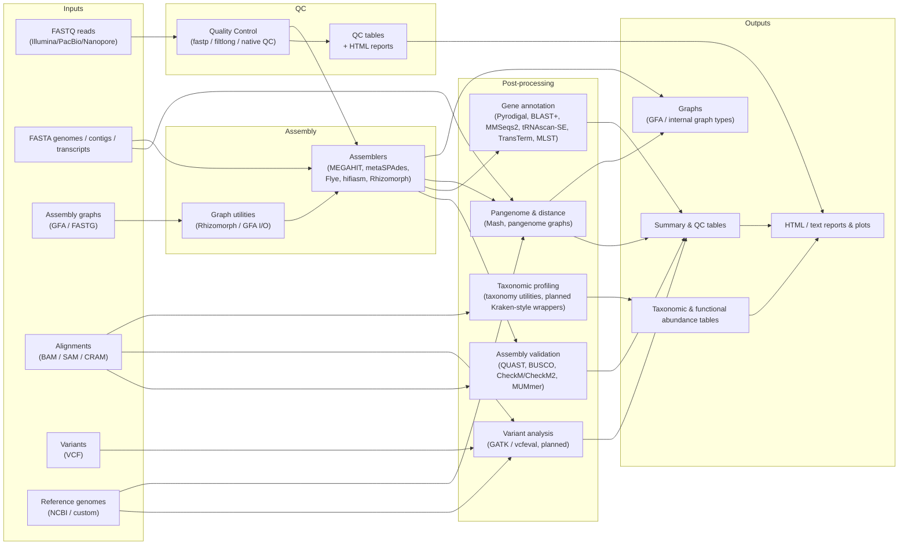

# Workflow & Tool Map

A comprehensive, à la carte map of Mycelia’s capabilities. Each row connects:

- **Input data type** (FASTQ/FASTA/GFA/BAM/VCF, etc.)
- **Mycelia entry points** (Julia functions)
- **Wrapped third-party tools**
- **Outputs** (assemblies, QC tables, summary results, taxonomic abundance tables, etc.)
- **Tutorials** that walk through the transformation

Planned capabilities are rendered in shaded cells so we can see what still needs to be built.

---

## High-Level Data Flow (Mermaid)

Use this diagram as the “big picture”; the tables below are the detailed à la carte menu.

---

## 1. End-to-End Menu (by Input Type)

### 1.1 FASTQ / FASTA / GFA / BAM / VCF → Outputs

| Input                                                      | Mycelia entry points                                                                                                             | Wrapped tools                                                                                        | Outputs                                                                                                       | Tutorial links                                                                                                                                               |
| ---------------------------------------------------------- | -------------------------------------------------------------------------------------------------------------------------------- | ---------------------------------------------------------------------------------------------------- | ------------------------------------------------------------------------------------------------------------- | ------------------------------------------------------------------------------------------------------------------------------------------------------------ |
| FASTQ short reads (Illumina)                               | `analyze_fastq_quality`, `calculate_gc_content`, `assess_duplication_rates`, `qc_filter_short_reads_fastp`, `trim_galore_paired` | fastp, Trim Galore                                                                                   | QC HTML reports, filtered FASTQ, per-sample QC tables                                                         | [Quality Control](generated/tutorials/02_quality_control.md)                                                                                                 |
| FASTQ long reads (ONT / PacBio)                            | `qc_filter_long_reads_filtlong`, native FASTQ QC utilities                                                                       | Filtlong                                                                                             | Filtered FASTQ, length/quality distributions, QC tables                                                       | [Quality Control](generated/tutorials/02_quality_control.md#long-read-qc)                                                                                    |
| FASTA references (genomes, contigs, transcripts)           | `open_fastx`, `convert_sequence`, `count_canonical_kmers`, distance functions                                                    | —                                                                                                    | Canonical sequences, k-mer matrices, distance matrices                                                        | [K-mer Analysis](generated/tutorials/03_kmer_analysis.md)                                                                                                    |
| Mixed FASTA / FASTQ sets                                   | `count_canonical_kmers`, `jaccard_distance`, `kmer_counts_to_js_divergence`                                                      | —                                                                                                    | K-mer spectra, Jaccard / JS distance tables, plots                                                            | [K-mer Analysis](generated/tutorials/03_kmer_analysis.md#distance-metrics)                                                                                   |
| PacBio / Nanopore reads (simulated)                        | `simulate_pacbio_reads`, `simulate_nanopore_reads`                                                                               | PBSim / DeepSimulator (via wrappers)                                                                 | FASTQ read sets + ground-truth tables                                                                         | [Data Acquisition](generated/tutorials/01_data_acquisition.md#simulate-reads)                                                                                |
| Illumina reads (simulated)                                 | `simulate_illumina_reads`                                                                                                        | ART                                                                                                  | FASTQ read sets + ground-truth tables                                                                         | [Data Acquisition](generated/tutorials/01_data_acquisition.md#simulate-reads)                                                                                |
| Public genomes (NCBI)                                      | `download_genome_by_accession`, `prefetch_sra_runs`, `fasterq_dump_parallel`                                                     | NCBI datasets / Entrez / SRA Toolkit                                                                 | FASTA/FASTQ datasets + accession metadata tables                                                              | [Data Acquisition](generated/tutorials/01_data_acquisition.md#download-from-ncbi)                                                                            |
| FASTQ (assembly)                                           | `assemble_genome` (front-end) → `run_megahit`, `run_metaspades`, `run_spades`, `run_flye`, `run_hifiasm`, `run_unicycler`        | MEGAHIT, metaSPAdes, SPAdes, Flye/metaFlye, hifiasm, Canu, SKESA, Unicycler                          | Contig/scaffold FASTA, assembly logs, GFA/FASTG graphs                                                        | [Genome Assembly](generated/tutorials/04_genome_assembly.md)                                                                                                 |
| FASTQ (native / experimental assembly)                     | `mycelia_iterative_assemble`, `improve_read_set_likelihood`, `find_optimal_sequence_path`                                        | — (native Rhizomorph graphs)                                                                         | Iteratively improved reads, qualmer/string graphs, checkpoint metadata                                        | Planned: `12_rhizomorph_graphs.jl`                                                                            |
| GFA / FASTG assembly graphs                                | `read_gfa_next`, `build_kmer_graph_next`, `build_qualmer_graph_next`, `write_quality_biosequence_gfa`                            | —                                                                                                    | Parsed graph objects, simplified graphs, re-exported GFA/FASTG                                                | [Graph Type Tutorials](generated/tutorials/04_graph_type_tutorials.md), [Round-Trip Graphs](generated/tutorials/09_round_trip_05_fastq_graphs.md)            |
| BAM / SAM / CRAM alignments                                | `xam_to_dataframe`, `visualize_genome_coverage`, `run_qualimap_bamqc`                                                            | samtools, Qualimap                                                                                   | Coverage plots, per-base depth tables, BAM-QC HTML reports                                                    | [Tool Integration](generated/tutorials/08_tool_integration.md), [Assembly Validation](generated/tutorials/05_assembly_validation.md#coverage)                |
| Assemblies (FASTA) + references                            | `assess_assembly_quality`, `run_quast`, `run_busco`, `run_mummer`                                                                | QUAST, BUSCO, MUMmer, CheckM/CheckM2                                                                 | Assembly QC summary tables, BUSCO metrics, alignment plots                                                    | [Assembly Validation](generated/tutorials/05_assembly_validation.md)                                                                                         |
| Gene prediction inputs (assembled contigs)                 | `run_pyrodigal`, `run_blastp_search`, `run_mmseqs_search`, `run_transterm`, `run_trnascan`, `run_mlst`                           | Pyrodigal, BLAST+, MMSeqs2, TransTerm, tRNAscan-SE, MLST                                             | GFF3 annotations, protein FASTA, functional/categorical tables                                                | [Gene Annotation](generated/tutorials/06_gene_annotation.md)                                                                                                 |
| Multiple assemblies (FASTA genomes)                        | `build_genome_distance_matrix`, `pairwise_mash_distance_matrix`, `construct_pangenome_pggb`, `construct_pangenome_cactus`        | Mash/MinHash, PGGB, cactus                                                                           | Distance matrices, clustered panels, pangenome graphs, summary tables                                         | [Comparative Genomics](generated/tutorials/07_comparative_genomics.md)                                                                                       |
| Taxonomic profiling inputs (classified alignments, tables) | `classify_taxonomy_aware_xam_table`, `plot_taxa_abundances`, `visualize_xam_classifications`                                     | Native taxonomy utilities, Krona/plotting                                                            | Taxonomic abundance tables, Sankey/stacked plots                                                              | [Tool Integration](generated/tutorials/08_tool_integration.md)                                                                                               |
| Graph-derived sequences                                    | `build_string_graph`, `string_to_ngram_graph`, `assemble_strings`                                                                | —                                                                                                    | String graphs, reconstructed sequences, evidence-tracking tables                                              | [Round-Trip: String Graphs](generated/tutorials/09_round_trip_01_string_graphs.md), [N-gram Graphs](generated/tutorials/09_round_trip_02_ngram_to_string.md) |
| Graph-derived sequences                                    | `build_string_graph`, `string_to_ngram_graph`, `assemble_strings`                                                                | —                                                                                                    | String graphs, reconstructed sequences, evidence-tracking tables                                              | [Round-Trip: String Graphs](generated/tutorials/09_round_trip_01_string_graphs.md), [N-gram Graphs](generated/tutorials/09_round_trip_02_ngram_to_string.jl) |
| Qualmer graphs                                             | `build_qualmer_graph`, `get_qualmer_statistics`, simplification helpers                                                          | —                                                                                                    | Quality-weighted sequence graphs, path correctness scores, diagnostic tables                                  | Planned: `12_rhizomorph_graphs.jl`                                                                            |
| Protein sequences                                          | `reduce_amino_alphabet`, `analyze_amino_acids`                                                                                   | —                                                                                                    | Reduced alphabet sequences, amino acid composition tables                                                     | [Reduced Amino Acid Alphabets](generated/tutorials/11_reduced_amino_acid_alphabets.md)                                                                       |
| Viroid / viral genomes                                     | `assemble_genome` (circular options), `validate_assembly`                                                                        | Flye/metaFlye, QUAST                                                                                 | Circular contig FASTA, QC tables                                                                              | [Viroid Assembly Workflow](generated/tutorials/10_viroid_assembly_workflow.md)                                                                               |
| VCF + BAM + reference FASTA                                | `normalize_vcf`, `update_fasta_with_vcf`, `evaluate_variant_calling_accuracy`     | GATK HaplotypeCaller, RTG vcfeval                     | Normalized VCF, updated reference, ROC/precision–recall tables | Planned: Variant Calling Tutorial                                                                             |
| Metagenomic reads (amplicon / shotgun)                     | `run_metaspades`, `run_metaflye`, `profile_taxa`, `bin_metagenome`                | metaSPAdes, MetaFlye, Kraken2/Bracken, MetaBAT/MaxBin | MAG bins, taxonomic abundance tables, bin-quality summaries    | Planned: Metagenomics Tutorial                                                                                |
| GFA → interactive graph curation                           | `curate_assembly_graph`                                                           | Bandage integration                                   | Curated graph, manual edits exported to GFA                    | Planned: GFA Curation Tutorial                                                                                |
| Phylogenetic trees                                         | `construct_phylogeny`, `plot_phylogeny`                                           | RAxML, IQ-TREE                                        | Newick trees, phylogenetic plots                               | Planned: Phylogenetics Tutorial                                                                               |

---

## 2. Capability Matrix (by Task)

This mirrors patch 2’s capability section and ensures everything is covered from a “what do I want to do?” perspective.

| Capability            | Entry points                                                                                                                  | Inputs                                                                   | Outputs                                                                        | Tooling                                                          |
| --------------------- | ----------------------------------------------------------------------------------------------------------------------------- | ------------------------------------------------------------------------ | ------------------------------------------------------------------------------ | ---------------------------------------------------------------- |
| Data acquisition      | `download_genome_by_accession`, `prefetch_sra_runs`, `fasterq_dump_parallel`                                                  | Accessions / run tables                                                  | FASTA/FASTQ, metadata                                                          | NCBI E-utilities, SRA Toolkit                                    |
| Read simulation       | `simulate_illumina_reads`, `simulate_pacbio_reads`, `simulate_nanopore_reads`                                                 | Reference FASTA, sim params                                              | FASTQ reads, ground-truth tables                                               | ART, PBSim, DeepSimulator                                        |
| Quality filtering     | `qc_filter_short_reads_fastp`, `qc_filter_long_reads_filtlong`, `trim_galore_paired`                                          | FASTQ                                                                    | Filtered FASTQ, HTML reports                                                   | fastp, Filtlong, Trim Galore                                     |
| Quality metrics       | `analyze_fastq_quality`, `assess_duplication_rates`, `robust_cv`, `robust_threshold`, `filter_genome_outliers`                | FASTQ, QC tables                                                         | Summary QC tables, outlier flags                                               | Native Julia                                                     |
| Assembly              | `assemble_genome`, `run_megahit`, `run_metaspades`, `run_spades`, `run_flye`, `run_hifiasm`, `mycelia_iterative_assemble`     | FASTQ, config                                                            | Contigs/scaffolds, assembly graphs                                             | External assemblers + native graphs                              |
| Assembly validation   | `assess_assembly_quality`, `run_quast`, `run_busco`, `run_mummer`, CheckM/CheckM2 integration                                 | Assemblies + references                                                  | QC reports, summary tables                                                     | QUAST, BUSCO, MUMmer, CheckM                                     |
| Graph utilities       | `build_string_graph`, `build_fasta_graph`, `build_qualmer_graph`, `read_gfa_next`, `write_quality_biosequence_gfa`            | FASTA/FASTQ/GFA                                                          | Graph objects, GFA exports                                                     | Native Julia (Rhizomorph)                                        |
| Comparative genomics  | `construct_pangenome_pggb`, `construct_pangenome_cactus`, `build_genome_distance_matrix`, `analyze_pangenome_kmers`           | Assemblies, sketch files                                                 | Pangenome graphs, distance matrices                                            | PGGB, cactus, Mash-like tools                                    |
| Taxonomy              | `classify_taxonomy_aware_xam_table`, `plot_taxa_abundances`, `visualize_xam_classifications`                                  | Mapping tables, taxonomic refs                                           | Abundance tables, taxonomy plots                                               | Native Julia, plotting libs                                      |
| Alignment & search    | `run_blastp_search`, `run_mmseqs_search`, `run_diamond_search`, `run_minimap2` helpers                                        | FASTA/FASTQ, databases                                                   | Alignments (SAM/BAM), hit tables                                               | BLAST+, MMSeqs2, DIAMOND, minimap2                               |
| Variant analysis      | `run_gatk_haplotypecaller`, `run_vcfeval`, `evaluate_variant_calling_accuracy` | BAM/CRAM, VCF, references | VCFs, ROC tables, summary stats | GATK, RTG vcfeval |
| Cloud & orchestration | `rclone_copy`, `rclone_sync`, `render_sbatch`, `submit_sbatch`, `lawrencium_sbatch`, `nersc_sbatch`                           | Paths, SLURM params                                                      | Synced data, sbatch scripts, submitted jobs                                    | rclone, SLURM                                                    |

---

## 3. Module coverage & doc gaps

### 3.1 Auto-included modules (from `src/Mycelia.jl`)

These bullets are the distilled, user-facing summary from patch 1; keep this section short here and point to `api/function-coverage.md` and the planning doc for details.

- **Core graph + I/O**: `utility-functions.jl`, `alphabets.jl`, `constants.jl`, `fastx.jl`, `graph-core.jl`, `sequence-graphs-next.jl`, `string-graphs.jl`, `qualmer-analysis.jl`, `qualmer-graphs.jl`, `fasta-graphs.jl`, `fastq-graphs.jl`
  → Exposed via Rhizomorph: `build_string_graph`, `build_fasta_graph`, `build_qualmer_graph`, path-finding & simplification utilities.
- **Assembly pipelines**: `assembly.jl` (external assemblers), `iterative-assembly.jl` (`mycelia_iterative_assemble`, `improve_read_set_likelihood`, `find_optimal_sequence_path`), `viterbi-next.jl`.
- **Analytics & QC**: `quality-control-and-benchmarking.jl`, `performance-benchmarks.jl`, `kmer-analysis.jl`, `distance-metrics.jl`.
- **Taxonomy & annotation**: `taxonomy-and-trees.jl`, `classification.jl`, `reference-databases.jl`, `annotation.jl`.
- **Wrappers & orchestration**: `bioconda.jl`, `rclone.jl`, `slurm-sbatch.jl`, `neo4jl.jl`, `xam.jl`.

> For full coverage counts and which functions are currently documented vs missing, see:
>
> - [`api/function-coverage.md`](api/function-coverage.md)
> - `planning-docs/WORKFLOW_COVERAGE_NOTES.md`
