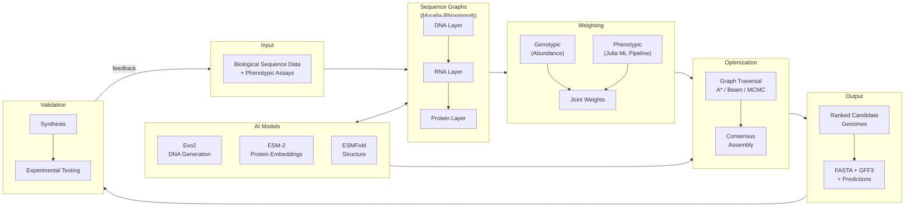

# TECHNICAL IMPLEMENTATION PLAN

## Generative Sequence Design Framework

| Field                   | Value                                                                                              |
| ----------------------- | -------------------------------------------------------------------------------------------------- |
| **Document Version**    | 1.0                                                                                                |
| **Date**                | February 2026                                                                                      |
| **Author**              | Cameron Prybol                                                                                     |
| **Affiliation**         | Lawrence Berkeley National Laboratory                                                              |
| **Package**             | Mycelia.jl ([github.com/cjprybol/Mycelia](https://github.com/cjprybol/Mycelia))                    |
| **Application Domains** | Designer microbes, biosynthetic pathway engineering, bacteriophage therapy, microbiome engineering |

---

## TODO

> **Note:** This section tracks outstanding items requiring follow-up before the
> document can be considered complete.

### High Priority

- [ ] Define acceptance criteria for each component's transition from "IN
      VALIDATION" to "COMPLETE"
- [ ] Establish feature importance leaderboard infrastructure (Julia-native)
- [ ] Design forward simulation framework for data requirement projections
- [ ] Select and validate Julia ML ecosystem packages (MLJ.jl, EvoTrees.jl,
      Flux.jl)

### Medium Priority

- [ ] Document cross-validation strategy to prevent data leakage across
      strain/organism panels
- [ ] Define versioning scheme for graph structures and model weights
- [ ] Design checkpointing strategy for long-running ML training jobs on HPC
- [ ] Evaluate genome synthesis vendor options for validation experiments

### Low Priority / Future Planning

- [ ] Design Apptainer containerization standards for AI models on HPC
- [ ] Design archive compression strategy for cold storage on HPSS/CFS
- [ ] Evaluate GPU allocation strategies for NERSC Perlmutter

### Discussions Needed

- [ ] Experimental validation partnerships — high-throughput screening options
- [ ] LDRD 2026 alignment with Aeron — which application domains to prioritize
      for DOE

---

## 1. Executive Summary

The Generative Sequence Design Framework represents a paradigm shift in
biological sequence engineering. Rather than relying on traditional approaches
of screening natural isolates for desired properties, this framework enables
rational, AI-guided design of synthetic biological sequences with specified
functional properties.

This document outlines the technical implementation plan for extending
Mycelia.jl with generative sequence design capabilities over the course of 2026,
with the goal of establishing a fully self-contained, Julia-native platform for
AI-guided biological sequence engineering.

### 1.1 Key Objectives

- Integrate Mycelia's weighted biological sequence graphs with generative AI
  models
- Develop a Julia-native ML pipeline for phenotype prediction from graph-derived
  multi-omic features
- Build probabilistic optimization for joint likelihood maximization across
  DNA/RNA/Protein layers
- Generate candidate genomes with predicted functional profiles
- Validate computational predictions through synthesis and experimental testing

### 1.2 Success Criteria

1. Julia-native ML pipeline operational with benchmark datasets by Q3 2026
2. End-to-end generative pipeline operational by Q4 2026
3. At least 10 candidate genomes generated with >80% predicted confidence
4. Methods paper submitted to peer-reviewed journal (Nature Methods / Genome
   Research / Bioinformatics)

### 1.3 Application Domains

| Domain                               | Description                                                                                                  | Relevance                      |
| ------------------------------------ | ------------------------------------------------------------------------------------------------------------ | ------------------------------ |
| **Designer microbes for DOE**        | Engineered living materials, biosynthetic pathways (bioplastics, polymers, enzymes), rhizosphere engineering | Primary — LDRD 2026 aligned    |
| **Biosynthetic pathway engineering** | Optimizing gene clusters for production of target compounds                                                  | Primary — DOE applications     |
| **Bacteriophage therapy**            | Rational design of synthetic phages targeting antibiotic-resistant pathogens                                 | Community application template |
| **Microbiome engineering**           | Designing organisms for environmental or health applications                                                 | Future expansion               |

### 1.4 System Architecture Overview



> **See also:** The detailed workflow diagram with component-level status is
> available in
> [`generative-sequence-design-workflow-detail.mermaid.md`](./generative-sequence-design-workflow-detail.mermaid.md).

---

## 2. Technical Architecture

### 2.1 Mycelia Module Mapping

Each component of the generative design framework maps to existing or planned
Mycelia modules:

| Framework Component        | Mycelia Module(s)                               | Status         |
| -------------------------- | ----------------------------------------------- | -------------- |
| DNA pangenome graphs       | `src/rhizomorph/` (k-mer, OLC, qualmer graphs)  | IN VALIDATION  |
| RNA transcriptome graphs   | `src/rhizomorph/` (RNA k-mer graphs)            | IN VALIDATION  |
| Protein sequence graphs    | `src/rhizomorph/` (amino acid k-mer/OLC graphs) | IN VALIDATION  |
| BPE/Unigram token graphs   | `src/sentencepiece.jl`                          | Implemented    |
| K-mer counting & analysis  | `src/kmer-analysis.jl`                          | Implemented    |
| Qualmer analysis           | `src/qualmer-analysis.jl`                       | Implemented    |
| Codon optimization         | `src/codon-optimization.jl`                     | Implemented    |
| Genome feature extraction  | `src/genome-features.jl`                        | Implemented    |
| Distance metrics           | `src/distance-metrics.jl`                       | Implemented    |
| Assembly (consensus)       | `src/assembly.jl`                               | Implemented    |
| Viterbi path-finding       | `src/viterbi-next.jl`                           | In Development |
| Pangenome construction     | `src/pangenome-analysis.jl`                     | Implemented    |
| Graph cleanup              | `src/graph-cleanup.jl`                          | Implemented    |
| Julia-native ML pipeline   | `src/ml-pipeline.jl` (NEW)                      | Planned        |
| Phenotypic weighting       | `src/phenotypic-weighting.jl` (NEW)             | Planned        |
| Language model integration | `src/language-model-integration.jl` (NEW)       | Planned        |

### 2.2 Graph Data Structures

The foundational layer consists of weighted sequence graphs representing
biological information at three levels. All graph types are implemented in
Mycelia's Rhizomorph subsystem.

#### 2.2.1 DNA Layer (Pangenome Graphs)

- **Data source:** Genome collections, public databases, user-provided sequence
  collections
- **Graph types:** de Bruijn (k-mer based), OLC (overlap-layout-consensus),
  BPE/Unigram token graphs
- **Mycelia modules:** `src/rhizomorph/` (fixed-length: k-mer, qualmer;
  variable-length: FASTA OLC, FASTQ OLC), `src/sentencepiece.jl` (BPE/Unigram)
- **Weighting:** Abundance-based (allele frequencies) + phenotypic association
  weights from ML models
- **Status:** IN VALIDATION — Unit tests passing, integration validation in
  progress

#### 2.2.2 RNA Layer (Transcriptome Graphs)

- **Data source:** Derived from DNA annotations, gene predictions
- **Purpose:** Capture transcriptional units, operons, regulatory elements
- **Mycelia modules:** Same Rhizomorph graph constructors, adapted for RNA
  alphabet
- **Status:** IN VALIDATION — Unit tests passing, integration validation in
  progress

#### 2.2.3 Protein Layer (Protein Sequence Graphs)

- **Data source:** Translated ORFs, annotated proteins, functional domains
- **Graph types:** Same construction methods as DNA, adapted for amino acid
  alphabet
- **Mycelia modules:** Rhizomorph with amino acid alphabet support,
  `src/amino-acid-analysis.jl`
- **Status:** IN VALIDATION — Unit tests passing, integration validation in
  progress

### 2.3 Weighting System

#### 2.3.1 Genotypic Weights (Abundance-Based)

Weights reflect the relative frequency of sequence variants observed across the
collection of biological entities. Higher weights indicate more commonly
observed sequences, reflecting evolutionary fitness and stability.

- Normalized counts of k-mer/node occurrences (via `src/kmer-analysis.jl`)
- Edge weights proportional to co-occurrence frequencies
- Smoothing to handle rare variants (Laplace smoothing or similar)
- **Status:** IN VALIDATION — Unit tests passing, integration validation in
  progress

#### 2.3.2 Phenotypic Weights (Julia-Native ML Pipeline)

Weights derived from trained machine learning models associating multi-omic
features with application-specific phenotypes.

**Julia ML Ecosystem:**

| Package             | Role                                                         | Replaces               |
| ------------------- | ------------------------------------------------------------ | ---------------------- |
| **MLJ.jl**          | Unified ML framework (model composition, tuning, evaluation) | AutoGluon/scikit-learn |
| **EvoTrees.jl**     | Gradient boosting (XGBoost-equivalent, pure Julia)           | XGBoost Python         |
| **DecisionTree.jl** | Random forests, AdaBoost                                     | scikit-learn RF        |
| **Flux.jl**         | Neural networks (custom architectures)                       | PyTorch/TensorFlow     |
| **ShapML.jl**       | SHAP values for model interpretability                       | SHAP Python            |
| **MLJTuning**       | Hyperparameter optimization (grid, random, Latin hypercube)  | Optuna                 |

**ML Pipeline Architecture:**

```
Feature Extraction → Feature Engineering → Model Training → Evaluation → Prediction
       ↓                     ↓                    ↓              ↓            ↓
  Mycelia modules    Normalization,         MLJ.jl with     Bio hold-out   Active
  (k-mer, genome-   selection, pair        EvoTrees,       splits,        learning
   features,         features (cosine,     DecisionTree,   SHAP values,   (uncertainty-
   sentencepiece)    concat, products)     Flux            feature imp.    based ranking)
```

**Feature Extraction (leverages existing Mycelia modules):**

- `src/kmer-analysis.jl` → k-mer frequency vectors (DNA, RNA, Protein)
- `src/sentencepiece.jl` → BPE/Unigram token frequencies
- `src/genome-features.jl` → Gene annotations, GFF/GTF features
- `src/codon-optimization.jl` → Codon usage bias metrics (RSCU, CAI, tAI)
- `src/amino-acid-analysis.jl` → Amino acid composition, reduced alphabets
- `src/distance-metrics.jl` → Pairwise distances for pair features

**Biological Hold-Out Splits:**

- Cluster-representative K-fold cross-validation to prevent data leakage
- Organisms grouped by sequence similarity (via `src/clustering.jl`) before
  splitting
- Ensures model generalizes to novel organisms, not just seen variants

**Feature Engineering Checklist:**

The goal is to systematically evaluate feature types across embedding spaces to
build an empirical leaderboard identifying the most informative features for
phenotype prediction.

##### Sequence-Based Features

- [ ] **k-mer frequencies (DNA)** — Variable k sizes (k=3 to k=31) via
      `kmer-analysis.jl`
- [ ] **k-mer frequencies (RNA)** — Transcriptome-derived via `kmer-analysis.jl`
- [ ] **k-mer frequencies (Protein)** — Amino acid n-grams via
      `kmer-analysis.jl`
- [ ] **GC content** — Global and local (sliding window)
- [ ] **Codon usage bias** — RSCU, CAI, tAI metrics via `codon-optimization.jl`
- [ ] **Dinucleotide frequencies** — CpG, etc.
- [ ] **Sequence complexity** — Linguistic complexity, entropy measures
- [ ] **Repeat content** — Direct, inverted, tandem repeats
- [ ] **Motif occurrences** — Known regulatory motifs, promoters, RBS

##### Protein Domain Features

- [ ] **UniRef50 annotations** — Broad functional clustering
- [ ] **UniRef90 annotations** — Intermediate resolution
- [ ] **UniRef100 annotations** — Exact sequence matches
- [ ] **Pfam domains** — Protein family assignments
- [ ] **InterPro annotations** — Integrated domain signatures
- [ ] **VOG/COG/eggNOG categories** — Orthologous group assignments
- [ ] **KEGG pathway mappings** — Metabolic context (evaluate free alternatives:
      NCBI/Reactome)
- [ ] **Gene Ontology terms** — Functional annotations

##### Embedding-Based Features

- [ ] **Evo2 DNA embeddings** — Genome language model representations
- [ ] **ESM-2 protein embeddings** — Evolutionary scale modeling
- [ ] **ProtTrans embeddings** — Transformer-based protein representations
- [ ] **ESMFold structural embeddings** — Structure-informed representations
- [ ] **Custom trained embeddings** — Task-specific representation learning
      (Flux.jl)

##### Host-Interaction Features (Application-Specific)

- [ ] **Receptor binding domain signatures** — Specificity-determining features
- [ ] **Anti-defense system annotations** — Counter-defense mechanisms
- [ ] **Lysis cassette features** — Lytic pathway characteristics
- [ ] **Functional determinant motifs** — Known specificity markers

##### Structural Features

- [ ] **Predicted secondary structure** — Alpha helix, beta sheet, coil
      proportions
- [ ] **Predicted 3D structure metrics** — pLDDT scores, predicted contacts
- [ ] **Structural domain boundaries** — Domain parsing from structure
      predictions
- [ ] **Surface accessibility** — Predicted interaction surfaces

##### Genomic Context Features

- [ ] **Gene density** — Coding vs. non-coding ratios
- [ ] **Operon structure** — Co-transcription predictions
- [ ] **Synteny conservation** — Gene order conservation
- [ ] **Genomic islands** — Horizontal transfer signatures
- [ ] **Integration signals** — AttP/AttB sites, integrases

##### Physicochemical Features

- [ ] **Isoelectric point (pI)** — Protein charge predictions
- [ ] **Hydrophobicity profiles** — GRAVY scores, hydrophobic moment
- [ ] **Molecular weight distributions** — Protein size characteristics
- [ ] **Instability index** — Protein stability predictions
- [ ] **Aliphatic index** — Thermostability proxy

**Feature Evaluation Framework:**

| Metric              | Description                                       |
| ------------------- | ------------------------------------------------- |
| Predictive accuracy | Cross-validated performance on held-out organisms |
| Feature importance  | SHAP values (ShapML.jl), permutation importance   |
| Information gain    | Mutual information with phenotype labels          |
| Embedding quality   | Clustering coherence, downstream task transfer    |
| Computational cost  | Feature extraction time, storage requirements     |

- **Output:** Feature importance scores mapped to graph nodes/edges
- **Status:** PLANNED — Julia-native implementation

#### 2.3.3 Joint Weighting

The final edge/node weights combine genotypic and phenotypic components:

> _W_joint = α × W_genotypic + β × W_phenotypic_

Where α and β are tunable hyperparameters. Initial values: α=0.3, β=0.7
(emphasizing phenotypic relevance).

---

## 3. AI Model Integration

### 3.1 Genome Language Models (DNA Layer)

#### 3.1.1 Evo2 Integration

Evo2 is a state-of-the-art genome language model capable of generating novel DNA
sequences conditioned on context.

- **Model:** Evo2 (Arc Institute, open source)
- **Status:** VALIDATED — Successfully generating sequences
- **Julia integration:** PythonCall.jl for inference; all pre/post-processing in
  Julia
- **Use cases:**
  - Generate inter-gene connecting sequences
  - Propose regulatory regions
  - Explore novel sequence variants
  - Generate guided walks through sequence space

#### 3.1.2 Sequence Generation Workflow

1. Seed Evo2 with known graph node sequence (essential gene or high-weight
   feature)
2. Generate continuation sequences (variable length)
3. Map generated sequences back to graph structure
4. Score alignment to existing nodes/edges
5. Use as "reads" for consensus assembly of optimal paths

### 3.2 Protein Language Models (Protein Layer)

#### 3.2.1 Model Selection

- **ESM-2:** Meta's evolutionary scale modeling — embeddings for functional
  similarity
- **ProtTrans:** Transformer-based protein embeddings
- **Julia integration:** PythonCall.jl for inference; embeddings stored as Julia
  arrays
- **Status:** PLANNED — Q3 integration target

#### 3.2.2 Use Cases

- Embed protein sequences to identify functionally equivalent variants
- Guide sequence optimization while preserving function
- Identify conserved functional motifs across diverse sequences
- Suggest amino acid substitutions that maintain structure/function

### 3.3 Folding Models (Structure Validation)

#### 3.3.1 Model Selection

- **ESMFold:** Fast structure prediction from ESM-2 embeddings
- **AlphaFold2:** Gold-standard structure prediction for validation
- **Status:** PLANNED — Q3 integration target

#### 3.3.2 Validation Workflow

1. Generate candidate protein sequences (from graph traversal or PLM
   suggestions)
2. Predict structure with ESMFold (fast screening)
3. Compare predicted structure to reference (RMSD, TM-score)
4. Filter candidates maintaining structural integrity
5. Validate top candidates with AlphaFold2 for higher confidence

### 3.4 In-Silico Saturation Mutagenesis

Systematic exploration of sequence variants beyond naturally observed diversity:

- Generate all single-point mutations at key positions
- Score variants using PLM likelihood and folding model validation
- Identify potentially beneficial mutations not yet sampled by nature
- Expand graph with high-scoring novel variants

---

## 4. Optimization Algorithms

### 4.1 Graph Traversal Strategy

#### 4.1.1 Distance Transformation

Transform edge weights to distances for shortest-path algorithms:

> _d(e) = 1/p(e)_ or _d(e) = -log(p(e))_

This enables use of standard shortest-path algorithms (A\*, Dijkstra) to find
maximum-likelihood paths. Mycelia's existing `src/distance-metrics.jl` and
Rhizomorph path-finding algorithms provide the foundation.

#### 4.1.2 Constrained Path Finding

**Biological constraints:**

- **Essential gene coverage:** Path must visit all required essential genes
- **Phenotypic feature inclusion:** Maximize coverage of efficacy-associated
  features
- **Genome topology:** Single circular chromosome, proper termini
  (application-dependent)
- **Reading frame consistency:** Maintain ORF integrity across traversals

#### 4.1.3 Algorithm Options

- **A\* with landmarks:** Essential genes as required waypoints
- **Beam search:** Maintain top-k partial paths, prune low-probability branches
- **Markov chain sampling:** Probabilistic walks weighted by edge probabilities
  (extends existing Rhizomorph probabilistic walks)
- **Viterbi decoding:** Maximum likelihood path via `src/viterbi-next.jl`
- **Reinforcement learning (future):** Learn optimal traversal policy through
  simulation (extends existing RL variants in `src/development/`)

### 4.2 Consensus Assembly

Generated walks (from graph traversal and LLM generation) are assembled to
identify consensus sequences:

1. Collect multiple traversal outputs and LLM-generated sequences
2. Treat as "reads" for assembly (via `src/assembly.jl`)
3. Identify consensus paths with highest aggregate support
4. Extract alternative paths (lower confidence variants)
5. Rank all candidates by joint likelihood score

### 4.3 Candidate Genome Generation

#### 4.3.1 Output Format

Each candidate genome includes:

- Complete nucleotide sequence (FASTA)
- Gene annotations (GFF3) via `src/genome-features.jl`
- Joint likelihood score
- Component scores (genotypic, phenotypic, structural)
- Predicted functional profile (application-specific)
- Confidence intervals

#### 4.3.2 Ranking Criteria

Candidates ranked by:

1. Joint probability score (primary)
2. Predicted functional efficacy for target application
3. Predicted specificity/breadth profile
4. Structural validation confidence (folding models)
5. Synthesis feasibility (GC content, repeat structures)

---

## 5. Implementation Timeline

### 5.1 Q2 2026: Julia-Native ML Pipeline

**Focus:** Build the fully self-contained ML pipeline in Julia

| Task                                                                 | Timeline | Status  |
| -------------------------------------------------------------------- | -------- | ------- |
| Evaluate and select Julia ML packages (MLJ.jl, EvoTrees.jl, Flux.jl) | Apr W1-2 | PLANNED |
| Implement feature extraction pipeline using existing Mycelia modules | Apr W2-4 | PLANNED |
| Implement biological hold-out splits (cluster-representative K-fold) | May W1-2 | PLANNED |
| Implement model training framework (MLJ.jl integration)              | May W2-4 | PLANNED |
| Implement feature importance / SHAP values                           | Jun W1-2 | PLANNED |
| Benchmark on publicly available phenotype datasets                   | Jun W2-4 | PLANNED |

### 5.2 Q3 2026: Integration

**Focus:** AI model integration and phenotypic weighting

| Task                                                   | Timeline      | Status  |
| ------------------------------------------------------ | ------------- | ------- |
| Phenotypic weighting module (uses ML pipeline outputs) | Jul W1-3      | PLANNED |
| Evo2 inference integration (PythonCall.jl wrapper)     | Jul W3-Aug W1 | PLANNED |
| Protein language model integration (ESM-2)             | Aug W1-3      | PLANNED |
| Folding model pipelines (ESMFold, AlphaFold2)          | Aug W3-Sep W2 | PLANNED |
| Graph traversal algorithm implementation               | Sep W2-4      | PLANNED |

### 5.3 Q3-Q4 2026: Optimization & Validation

**Focus:** End-to-end genome generation and candidate ranking

| Task                                   | Timeline      | Status  |
| -------------------------------------- | ------------- | ------- |
| End-to-end pipeline integration        | Oct W1-3      | PLANNED |
| Run optimization on benchmark datasets | Oct W3-Nov W2 | PLANNED |
| Generate and rank candidate genomes    | Nov W2-4      | PLANNED |
| Validation framework and benchmarks    | Dec W1-4      | PLANNED |

### 5.4 2027: Application Templates & Publication

- Application template: Designer microbes for DOE (rhizosphere, biosynthetic
  pathways)
- Application template: Bacteriophage therapy (community-contributed)
- Methods paper submission

---

## 6. Resource Requirements

### 6.1 Computational Infrastructure

| Resource                   | Purpose                                                            | Notes                               |
| -------------------------- | ------------------------------------------------------------------ | ----------------------------------- |
| **NERSC (Perlmutter)**     | GPU inference for Evo2, ESM-2, AlphaFold2; large-scale ML training | DOE allocation; A100 GPUs available |
| **Lawrencium**             | Development, testing, batch processing                             | LBNL allocation                     |
| **Lovelace**               | CI/CD, continuous integration, Memgraph                            | Dedicated LBNL node (2TB RAM)       |
| **HPC Storage**            | Raw data and output persistence                                    | CFS (community), HPSS (archival)    |
| **DataFrames.jl / DuckDB** | Structured data analysis                                           | Julia-native, replaces BigQuery     |

#### 6.1.1 Data Management Principles

1. **Reproducibility:** All processing inputs (code, parameters, data)
   version-controlled
2. **Rebuild capability:** Analysis outputs should be reconstructable from raw
   data + code
3. **Checkpointing:** Use Mycelia `src/checkpointing.jl` for long-running
   computations
4. **Archive vs. delete:** Compress and migrate cold data rather than deleting
   compute-intensive outputs
5. **AI model stability:** Containerize models with Apptainer to ensure
   reproducible inference on HPC
6. **Job templates:** Use `src/slurm-sbatch.jl` and `src/slurm-templates.jl` for
   batch submission

### 6.2 Data Assets

| Asset                                   | Status           | Notes                         |
| --------------------------------------- | ---------------- | ----------------------------- |
| DNA Layer (Pangenome graphs)            | IN VALIDATION    | Mycelia Rhizomorph            |
| RNA Layer (Transcriptome graphs)        | IN VALIDATION    | Mycelia Rhizomorph            |
| Protein Layer (Protein sequence graphs) | IN VALIDATION    | Mycelia Rhizomorph            |
| Genotypic Weights                       | IN VALIDATION    | k-mer abundance from Mycelia  |
| Phenotypic Weights                      | PLANNED          | Julia ML pipeline (new)       |
| Public genomic databases                | Available        | NCBI, UniProt, RefSeq         |
| Benchmark phenotype datasets            | To be identified | Public data for ML validation |

### 6.3 External Dependencies

| Dependency               | Status          | Notes                      |
| ------------------------ | --------------- | -------------------------- |
| Evo2 model access        | Confirmed       | Arc Institute, open source |
| ESM-2/ESMFold            | Available       | Open source (Meta AI)      |
| AlphaFold2               | Available       | Open source (DeepMind)     |
| MLJ.jl ecosystem         | Available       | Julia package registry     |
| EvoTrees.jl              | Available       | Julia package registry     |
| Flux.jl                  | Available       | Julia package registry     |
| Genome synthesis vendors | To be evaluated | Twist, Ansa, IDT, others   |

---

## 7. Risk Management

| Risk                                 | Impact | Likelihood | Mitigation                                                                        |
| ------------------------------------ | ------ | ---------- | --------------------------------------------------------------------------------- |
| Synthesis failures                   | High   | Medium     | Pre-screen for synthesis feasibility (GC content, repeats, secondary structure)   |
| Model predictions don't validate     | High   | Medium     | Conservative ranking; diversified candidates; build validation data feedback loop |
| HPC allocation constraints           | Medium | Low        | Multiple systems available (NERSC, Lawrencium, Lovelace); Apptainer portability   |
| Julia ML ecosystem gaps              | Medium | Low        | PythonCall.jl fallback for specific models; contribute to Julia ecosystem         |
| Timeline delays                      | Medium | Medium     | Buffer time in schedule; modular design enables parallel progress                 |
| Feature leaderboard doesn't converge | Medium | Medium     | Establish minimum viable feature set; iterate with additional data                |
| Community adoption slow              | Low    | Medium     | Focus on publication and reproducible benchmarks first; community follows quality |

---

## 8. Experimental Validation Strategy

### 8.1 Essential Gene Set Definition

The minimal essential gene set is derived from observational analysis of
naturally occurring genomes. Genes present in >95% of genomes within a clade are
considered essential.

**Validation approaches:**

- **Comparative genomics:** Cross-clade essential gene conservation analysis
- **High-throughput mutagenesis screens:** Systematic disruption to identify
  loss-of-function phenotypes
- **Transposon insertion profiling:** Identify dispensable vs. essential regions

> **Note:** High-throughput screens of "how to break an organism" are likely
> more cost-effective and data-rich than whole genome synthesis tests until
> costs come down. These experiments simultaneously validate engineering
> approaches and generate training data for models.

### 8.2 Data Requirement Projections

To estimate the number of experimental data points needed to achieve target
prediction confidence:

**Approaches:**

1. **Analytical solution:** If the learning curve can be modeled mathematically,
   solve for n given target error rate
2. **Michaelis-Menten saturation curve fitting:** Model prediction error as a
   function of training data size:

   > _Error(n) = E_min + (E_max - E_min) × K / (K + n)_

   Where:
   - _E_min_ = asymptotic minimum error (irreducible)
   - _E_max_ = error with minimal data
   - _K_ = half-saturation constant (data points to reach midpoint)
   - _n_ = number of training examples

3. **Forward simulation:** Bootstrap from existing data to project learning
   curves

**Goal:** Determine the data collection strategy that minimizes experimental
cost while achieving target prediction accuracy.

---

## 9. Relationship to Mycelia Roadmap

This framework extends the existing Mycelia development roadmap as **Phase 6:
Generative Sequence Design**, building on all preceding phases:

| Phase       | Focus                          | Prerequisite for GSD?              |
| ----------- | ------------------------------ | ---------------------------------- |
| Phase 1     | Rhizomorph graph ecosystem     | Yes — graph infrastructure         |
| Phase 2     | Core algorithms & performance  | Yes — path-finding, simplification |
| Phase 3     | Production readiness           | Yes — stability, testing           |
| Phase 4     | Documentation                  | Enables community adoption         |
| Phase 5     | Advanced features (RL, TDA)    | Partially — RL traversal policies  |
| **Phase 6** | **Generative Sequence Design** | —                                  |

See `GENERATIVE_SEQUENCE_DESIGN_ROADMAP.md` for the detailed Phase 6
implementation plan.

---

## 10. Appendix

### 10.1 Tokenization Methods

| Method                       | Description                                                       | Typical Parameters                 |
| ---------------------------- | ----------------------------------------------------------------- | ---------------------------------- |
| **k-mer/de Bruijn**          | Fixed-length subsequences                                         | k=21-31 for DNA; k=3-5 for protein |
| **BPE (Byte Pair Encoding)** | Iteratively merge frequent adjacent tokens                        | Vocabulary size 1K-50K             |
| **Unigram**                  | Probability-based tokenization selecting most likely segmentation | Vocabulary size 1K-50K             |

All tokenization methods are implemented in Mycelia via `src/sentencepiece.jl`
(BPE/Unigram) and `src/kmer-analysis.jl` (k-mer/de Bruijn).

### 10.2 Glossary

| Term                 | Definition                                                                                                                                  |
| -------------------- | ------------------------------------------------------------------------------------------------------------------------------------------- |
| **Pangenome**        | Complete set of genes across all genomes in a collection                                                                                    |
| **de Bruijn graph**  | Graph where nodes are k-mers and edges connect overlapping k-mers                                                                           |
| **OLC**              | Overlap-Layout-Consensus assembly approach using variable-length overlaps                                                                   |
| **RSCU**             | Relative Synonymous Codon Usage — measure of codon bias                                                                                     |
| **CAI**              | Codon Adaptation Index — expression level predictor                                                                                         |
| **pLDDT**            | Predicted Local Distance Difference Test — AlphaFold confidence metric                                                                      |
| **ESKAPE pathogens** | _Enterococcus faecium, Staphylococcus aureus, Klebsiella pneumoniae, Acinetobacter baumannii, Pseudomonas aeruginosa, Enterobacter_ species |
| **Host range**       | The spectrum of target organisms an engineered entity can interact with                                                                     |
| **Rhizomorph**       | Mycelia's probabilistic genome assembler module                                                                                             |
| **MLJ.jl**           | Julia's unified machine learning framework                                                                                                  |
| **EvoTrees.jl**      | Pure Julia gradient boosting library                                                                                                        |
| **SHAP**             | SHapley Additive exPlanations — model interpretability method                                                                               |

### 10.3 Status Legend

| Symbol        | Status             | Description                                            |
| ------------- | ------------------ | ------------------------------------------------------ |
| COMPLETE      | Complete/Validated | Fully operational, tested, and validated               |
| IN VALIDATION | In Validation      | Unit tests passing, integration validation in progress |
| IN PROGRESS   | In Progress        | Active development, not yet testable                   |
| PLANNED       | Planned            | Scheduled for future implementation                    |
| BLOCKED       | Blocked            | Waiting on external dependency or decision             |

---

_Document Version: 1.0_ _Last Updated: February 2026_ _Author: Cameron Prybol,
Lawrence Berkeley National Laboratory_
