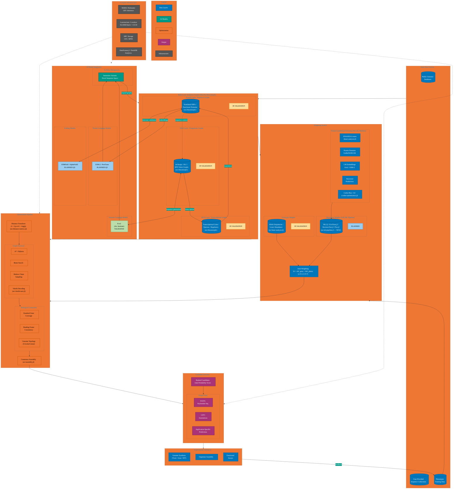

```mermaid
%%{init: {
  'theme': 'base',
  'themeVariables': {
    'background': '#FFFFFF',
    'primaryColor': '#0077BB',
    'primaryTextColor': '#FFFFFF',
    'primaryBorderColor': '#005588',
    'lineColor': '#333333',
    'secondaryColor': '#009988',
    'tertiaryColor': '#EE7733',
    'fontSize': '16px',
    'fontFamily': 'arial, sans-serif'
  }
}}%%
flowchart TB
    subgraph LEGEND["Legend"]
        direction LR
        L1["Data Layers"]
        L2["AI Models"]
        L3["Optimization"]
        L4["Output"]
        L5["Infrastructure"]
    end

    subgraph INPUT["Input Data Sources"]
        direction TB
        PDB[(Public Genomic<br/>Databases)]
        UCOL[(User-Provided<br/>Sequence Collections)]
        PHENO[(Phenotypic<br/>Training Data)]
    end

    subgraph LAYERS["Multi-Layer Sequence Graphs (Mycelia Rhizomorph)"]
        direction TB

        subgraph DNA_LAYER["DNA Layer - Pangenome Graphs"]
            DNA_GRAPH[("de Bruijn / OLC /<br/>BPE Token Graphs<br/>(src/rhizomorph/)")]
            DNA_STATUS["IN VALIDATION"]
        end

        subgraph RNA_LAYER["RNA Layer - Transcriptome Graphs"]
            RNA_GRAPH[("Transcriptional Units /<br/>Operons / Regulatory<br/>(src/rhizomorph/)")]
            RNA_STATUS["IN VALIDATION"]
        end

        subgraph PROTEIN_LAYER["Protein Layer - Sequence Graphs"]
            PROT_GRAPH[("Translated ORFs /<br/>Functional Domains<br/>(src/rhizomorph/)")]
            PROT_STATUS["IN VALIDATION"]
        end

        DNA_GRAPH -->|"transcription"| RNA_GRAPH
        RNA_GRAPH -->|"translation"| PROT_GRAPH
        PROT_GRAPH -.->|"sequence context"| DNA_GRAPH
    end

    subgraph WEIGHTS["Weighting System"]
        direction TB

        subgraph GENO_W["Genotypic Weights"]
            GENO[("Allele Frequencies /<br/>k-mer Abundance<br/>(src/kmer-analysis.jl)")]
            GENO_S["IN VALIDATION"]
        end

        subgraph PHENO_W["Phenotypic Weights (Julia ML Pipeline)"]
            PHENO_ML[("MLJ.jl / EvoTrees.jl /<br/>DecisionTree.jl / Flux.jl<br/>(src/ml-pipeline.jl — NEW)")]
            PHENO_S["PLANNED"]
        end

        subgraph FEATURES["Feature Leaderboard (Existing Mycelia Modules)"]
            direction LR
            F1["DNA/RNA k-mers<br/>(kmer-analysis.jl)"]
            F2["Protein Domains<br/>UniRef50/90/100"]
            F3["LM Embeddings<br/>Evo2 / ESM-2"]
            F4["Structural<br/>Predictions"]
            F5["Codon Bias / GC<br/>(codon-optimization.jl)"]
        end

        JOINT["Joint Weighting<br/>W = aW_geno + bW_pheno<br/>(a=0.3, b=0.7)"]

        GENO --> JOINT
        PHENO_ML --> JOINT
        FEATURES --> PHENO_ML
    end

    subgraph AI["AI Model Integration"]
        direction TB

        subgraph GLM["Genome Language Models"]
            EVO2["Evo2<br/>(Arc Institute)<br/>VALIDATED"]
        end

        subgraph PLM["Protein Language Models"]
            ESM2["ESM-2 / ProtTrans<br/>PLANNED Q3"]
        end

        subgraph FOLD["Folding Models"]
            ESMF["ESMFold / AlphaFold2<br/>PLANNED Q3"]
        end

        subgraph MUTAGENESIS["In-Silico Mutagenesis"]
            SAT["Saturation Variants<br/>Novel Sequence Space"]
        end
    end

    subgraph OPT["Optimization Pipeline"]
        direction TB

        TRANSFORM["Distance Transform<br/>d = 1/p or d = -log(p)<br/>(src/distance-metrics.jl)"]

        subgraph TRAVERSAL["Graph Traversal"]
            ASTAR["A* / Dijkstra"]
            BEAM["Beam Search"]
            MCMC["Markov Chain<br/>Sampling"]
            VITERBI["Viterbi Decoding<br/>(src/viterbi-next.jl)"]
        end

        subgraph CONSTRAINTS["Biological Constraints"]
            C1["Essential Gene<br/>Coverage"]
            C2["Reading Frame<br/>Consistency"]
            C3["Genome Topology<br/>(Circular/Linear)"]
        end

        CONSENSUS["Consensus Assembly<br/>(src/assembly.jl)"]

        TRANSFORM --> TRAVERSAL
        TRAVERSAL --> CONSTRAINTS
        CONSTRAINTS --> CONSENSUS
    end

    subgraph OUTPUT["Candidate Genomes"]
        direction TB

        RANKED["Ranked Candidates<br/>Joint Probability Score"]

        subgraph FILES["Output Files"]
            FASTA["FASTA<br/>Nucleotide Seq"]
            GFF["GFF3<br/>Annotations"]
            PRED["Application-Specific<br/>Predictions"]
        end

        RANKED --> FILES
    end

    subgraph VALIDATION["Experimental Validation"]
        direction TB
        SYNTH["Genome Synthesis<br/>(Twist / Ansa / IDT)"]
        ASSEMBLE["Organism Assembly"]
        SCREEN["Functional<br/>Assays"]
    end

    subgraph INFRA["Compute Infrastructure"]
        direction LR
        NERSC["NERSC Perlmutter<br/>GPU Inference"]
        LRC["Lawrencium / Lovelace<br/>SLURM Batch + CI/CD"]
        HPC["HPC Storage<br/>CFS / HPSS"]
        JULIA["DataFrames.jl / DuckDB<br/>Analytics"]
    end

    %% Main data flow
    INPUT --> LAYERS
    PHENO --> WEIGHTS

    %% AI integration with layers
    DNA_GRAPH <-->|"sequence generation"| EVO2
    PROT_GRAPH <-->|"embeddings"| ESM2
    PROT_GRAPH <-->|"structure validation"| ESMF
    EVO2 --> SAT
    ESM2 --> SAT
    SAT -->|"expand graphs"| LAYERS

    %% Layers to weights
    LAYERS --> WEIGHTS

    %% Weights to optimization
    JOINT --> OPT
    LAYERS --> OPT

    %% Optimization to output
    CONSENSUS --> OUTPUT

    %% Validation loop
    OUTPUT --> VALIDATION
    VALIDATION -->|"feedback"| PHENO

    %% Infrastructure supports all
    INFRA -.-> AI
    INFRA -.-> OPT
    INFRA -.-> OUTPUT

    %% Styling - Colorblind-friendly palette with high contrast
    %% Data Layer: Blue (#0077BB)
    classDef dataLayer fill:#0077BB,stroke:#005588,color:#FFFFFF,stroke-width:2px
    %% AI Models: Teal (#009988)
    classDef aiModel fill:#009988,stroke:#006655,color:#FFFFFF,stroke-width:2px
    %% Optimization: Orange (#EE7733)
    classDef optimization fill:#EE7733,stroke:#CC5500,color:#000000,stroke-width:2px
    %% Output: Magenta (#AA3377)
    classDef output fill:#AA3377,stroke:#882255,color:#FFFFFF,stroke-width:2px
    %% Infrastructure: Gray (#555555)
    classDef infra fill:#555555,stroke:#333333,color:#FFFFFF,stroke-width:2px
    %% Status - In Validation: Yellow (#FFDD99)
    classDef status fill:#FFDD99,stroke:#DDAA44,color:#000000,stroke-width:2px
    %% Status - Validated: Green (#BBDDAA)
    classDef validated fill:#BBDDAA,stroke:#88AA66,color:#000000,stroke-width:2px
    %% Status - Planned: Light Blue (#99CCEE)
    classDef planned fill:#99CCEE,stroke:#6699BB,color:#000000,stroke-width:2px
    %% Legend items
    classDef legendData fill:#0077BB,stroke:#005588,color:#FFFFFF,stroke-width:2px
    classDef legendAI fill:#009988,stroke:#006655,color:#FFFFFF,stroke-width:2px
    classDef legendOpt fill:#EE7733,stroke:#CC5500,color:#000000,stroke-width:2px
    classDef legendOut fill:#AA3377,stroke:#882255,color:#FFFFFF,stroke-width:2px
    classDef legendInfra fill:#555555,stroke:#333333,color:#FFFFFF,stroke-width:2px

    class DNA_GRAPH,RNA_GRAPH,PROT_GRAPH,GENO,PHENO_ML dataLayer
    class EVO2 validated
    class ESM2,ESMF planned
    class SAT aiModel
    class TRANSFORM,ASTAR,BEAM,MCMC,VITERBI,CONSENSUS,C1,C2,C3 optimization
    class RANKED,FASTA,GFF,PRED output
    class NERSC,LRC,HPC,JULIA infra
    class DNA_STATUS,RNA_STATUS,PROT_STATUS,GENO_S status
    class PHENO_S planned
    class L1 legendData
    class L2 legendAI
    class L3 legendOpt
    class L4 legendOut
    class L5 legendInfra
```
